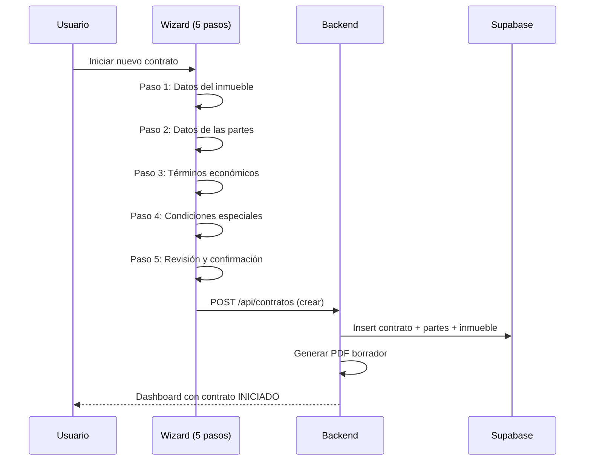
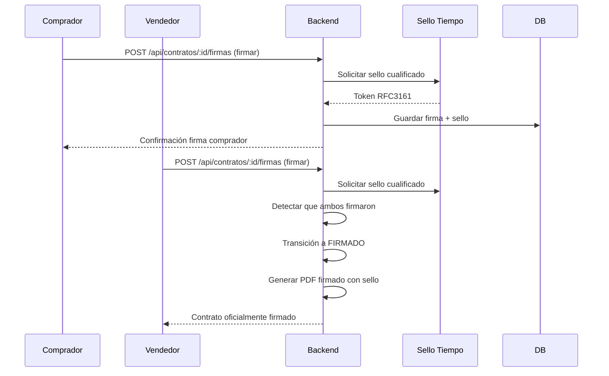
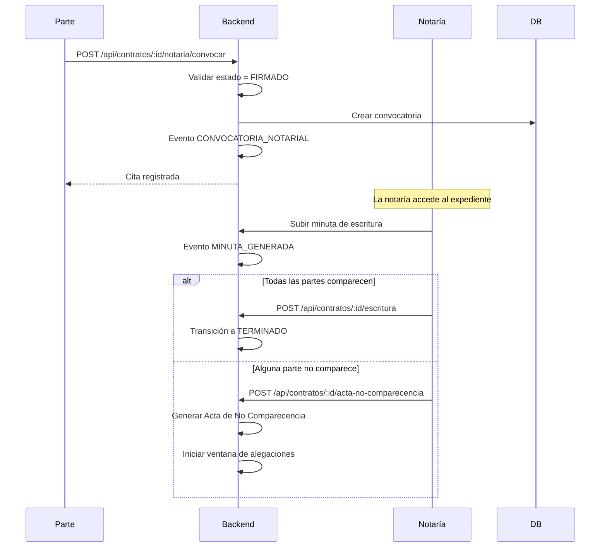
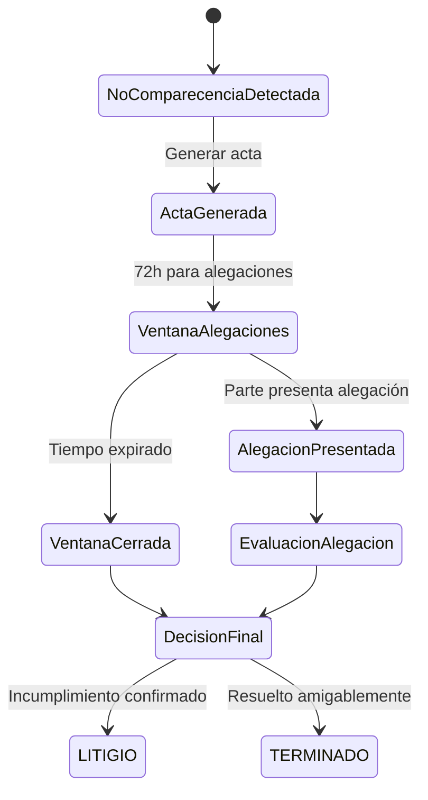
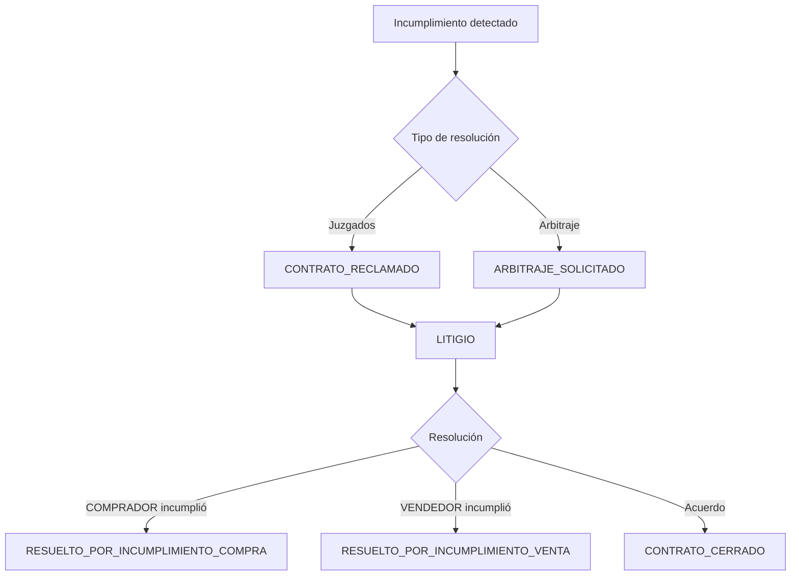
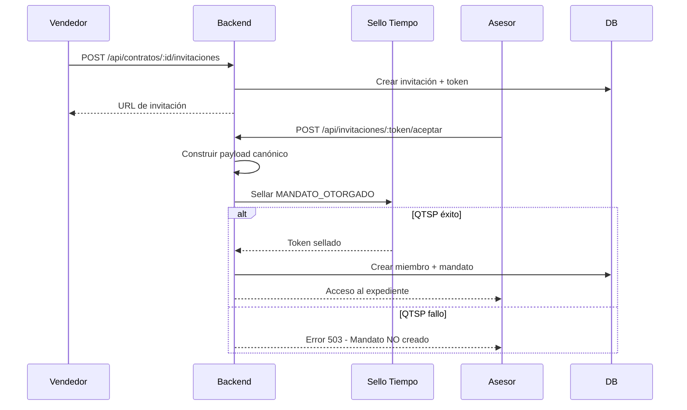

# Chrono-Flare: Sistema de Gestión de Contratos de Arras

**Plataforma SaaS para la gestión integral de contratos de arras con valor probatorio conforme a eIDAS (Reglamento UE 910/2014).**

---

## Índice

1. [Visión General](#visión-general)
2. [Estados del Contrato](#estados-del-contrato)
3. [Flujos Principales](#flujos-principales)
4. [Sistema de Roles y Mandatos](#sistema-de-roles-y-mandatos)
5. [Generación de Documentos](#generación-de-documentos)
6. [Auditoría y Certificación](#auditoría-y-certificación)
7. [API Endpoints](#api-endpoints)
8. [Arquitectura Técnica](#arquitectura-técnica)

---

## Visión General

Chrono-Flare es una plataforma especializada en la gestión de contratos de arras inmobiliarios, diseñada para:

- **Partes**: Comprador y vendedor
- **Asesores**: Agencias inmobiliarias, abogados, gestorías
- **Notarías**: Acceso para preparación de escritura
- **Observadores**: Acceso de solo lectura para supervisión

### Características Principales

| Característica | Descripción |
|----------------|-------------|
| 📜 **Contratos legales** | Generación automática de contratos de arras válidos |
| ✍️ **Firma electrónica** | Firma avanzada con sellado de tiempo cualificado |
| 👥 **Gestión de participantes** | Roles, mandatos e invitaciones |
| 📁 **Gestor documental** | Clasificación y validación de documentos |
| 💬 **Comunicaciones** | Mensajería certificada entre partes |
| 📊 **Auditoría completa** | Trazabilidad de todas las acciones |
| 📄 **Certificado de eventos** | Documento probatorio con valor legal |

---

## Estados del Contrato

El contrato sigue una máquina de estados definida:

```
INICIADO → BORRADOR → FIRMADO → NOTARIA → TERMINADO
                ↓                    ↓
              (cancelar)          LITIGIO
```

| Estado | Descripción | Acciones Disponibles |
|--------|-------------|---------------------|
| `INICIADO` | Alta inicial: inmueble, partes, términos | Editar contrato, subir documentos |
| `BORRADOR` | Términos aceptados, pendiente firma | Revisar, firmar |
| `FIRMADO` | Documento firmado en plataforma | Gestionar pagos, convocar notaría |
| `NOTARIA` | Con cita en notaría para escritura | Subir escritura, marcar comparecencia |
| `TERMINADO` | Compraventa completada o cerrado | Solo consulta |
| `LITIGIO` | En disputa por incumplimiento | Gestionar alegaciones, arbitraje |

---

## Flujos Principales

### 1. Flujo de Creación del Contrato



**Historias de usuario soportadas:**
- ✅ Como vendedor, puedo crear un contrato indicando los datos del inmueble
- ✅ Como comprador, puedo revisar los términos antes de firmar
- ✅ Como asesor, puedo crear contratos en nombre de mis clientes

### 2. Flujo de Firma



**Estados de firma:**
- `PENDIENTE`: Esperando firma
- `FIRMADO`: Firmado con sello de tiempo
- `RECHAZADO`: Firma rechazada explícitamente

**Historias de usuario soportadas:**
- ✅ Como parte, recibo notificación cuando debo firmar
- ✅ Como firmante, mi firma queda sellada con tiempo cualificado
- ✅ Como parte, puedo descargar el contrato firmado con prueba criptográfica

### 3. Flujo de Gestión Documental

El sistema clasifica documentos en categorías legales:

| Categoría | Tipos de Documento |
|-----------|-------------------|
| **Inmueble** | Nota simple, Escritura anterior, Recibo IBI, Certificado comunidad |
| **Identidad** | DNI/NIE Comprador, DNI/NIE Vendedor, Poderes |
| **Contractual** | Contrato arras borrador, Contrato firmado, Justificantes pago |
| **Notaría** | Minuta escritura, Escritura compraventa, Actas |

**Flujo de validación:**
1. Usuario sube documento
2. Sistema registra evento `DOCUMENTO_SUBIDO`
3. Contraparte puede validar → `DOCUMENTO_VALIDADO`
4. O rechazar con motivo → `DOCUMENTO_RECHAZADO`

### 4. Flujo de Convocatoria Notarial



**Historias de usuario soportadas:**
- ✅ Como parte, puedo convocar cita en notaría
- ✅ Como notaría, accedo al expediente para preparar la escritura
- ✅ Como notaría, puedo subir la minuta y la escritura final
- ✅ Como sistema, detecto no comparecencia y genero acta

### 5. Flujo de No Comparecencia

Cuando una parte no acude a la cita notarial:



**Evento generado**: `ACTA_NO_COMPARECENCIA`
**Documento**: Acta formal con datos del citado, fecha/hora, testigos

### 6. Flujo de Terminación Normal

El contrato termina correctamente cuando:

1. ✅ Contrato firmado por ambas partes
2. ✅ Arras pagadas y confirmadas
3. ✅ Escritura otorgada ante notario
4. ✅ Todas las partes comparecieron

**Transición**: `NOTARIA` → `TERMINADO`
**Evento**: `ESCRITURA_OTORGADA`

### 7. Flujo de Litigio

Cuando hay incumplimiento:



**Tipos de resolución configurables:**
- `JUZGADOS`: Vía judicial ordinaria
- `ARBITRAJE_NOTARIAL`: Arbitraje ante notario

---

## Sistema de Roles y Mandatos

### Roles de Usuario

| Rol | Descripción | Permisos por defecto |
|-----|-------------|---------------------|
| `ADMIN` | Administrador de la plataforma | Todos |
| `COMPRADOR` | Parte compradora | Firmar, subir docs, comunicar |
| `VENDEDOR` | Parte vendedora | Firmar, subir docs, comunicar |
| `TERCERO` | Asesor autorizado (agencia/abogado) | Según mandato |
| `NOTARIO` | Notaría interviniente | Lectura, subir docs notariales |
| `OBSERVADOR` | Acceso solo lectura | Solo consulta |

### Tipos de Mandato

Cuando un TERCERO actúa en nombre de una parte:

| Mandato | Descripción |
|---------|-------------|
| `PARTE_COMPRADORA` | Asesor autorizado del comprador |
| `PARTE_VENDEDORA` | Asesor autorizado del vendedor |
| `AMBAS_PARTES` | Asesor común (mediador) |
| `NOTARIA` | Autorización a notaría |
| `OBSERVADOR_TECNICO` | Solo lectura técnica |

### Permisos Granulares

| Permiso | Descripción |
|---------|-------------|
| `puede_subir_documentos` | Subir documentación |
| `puede_invitar` | Invitar otros participantes |
| `puede_validar_documentos` | Validar/rechazar documentos |
| `puede_firmar` | Firmar en nombre de la parte |
| `puede_enviar_comunicaciones` | Enviar mensajes certificados |

### Flujo de Invitación + Mandato



**Regla estricta**: Sin sello QTSP → Sin mandato válido

---

## Generación de Documentos

### 1. Contrato de Arras (PDF)

Generado automáticamente con:
- Datos del inmueble (dirección, referencia catastral)
- Datos de las partes (nombre, DNI, domicilio)
- Términos económicos (precio, arras, plazos)
- Condiciones especiales
- Cláusulas legales según tipo de arras

**Plantilla**: `contracts/template-utils.ts`
**Servicio**: `pdfService.ts`

### 2. Borrador de Escritura

Minuta preparatoria para notaría con:
- Resumen del contrato de arras
- Datos registrales del inmueble
- Cargas y gravámenes
- Condiciones pactadas

### 3. Acta de No Comparecencia

Documento formal que certifica:
- Citación realizada (fecha/hora/lugar)
- Parte no compareciente
- Testigos presentes
- Consecuencias legales

**Componente**: `ActaNoComparecencia.tsx`
**Servicio**: `actaService.ts`

### 4. Certificado de Eventos

Documento probatorio que incluye:
- Cronología completa de eventos
- Hash SHA-256 de cada evento
- Sellos de tiempo cualificados
- Cadena de integridad (blockchain-like)
- Intervinientes y régimen de actuación

**Componente**: `CertificadoEventos.tsx`
**Servicio**: `certificateService.ts`

---

## Auditoría y Certificación

### Eventos Registrados

Cada acción relevante genera un evento inmutable:

| Evento | Descripción |
|--------|-------------|
| `CONTRATO_CREADO` | Alta del contrato |
| `ACEPTACION_TERMINOS` | Parte acepta términos |
| `FIRMA_ELECTRONICA` | Firma con sello QTSP |
| `DOCUMENTO_SUBIDO` | Nuevo documento |
| `DOCUMENTO_VALIDADO` | Documento aprobado |
| `MANDATO_OTORGADO` | Nuevo mandato sellado |
| `MANDATO_REVOCADO` | Revocación sellada |
| `CONVOCATORIA_NOTARIAL` | Cita en notaría |
| `ACTA_NO_COMPARECENCIA` | No comparecencia |
| `ESCRITURA_OTORGADA` | Escritura firmada |
| `CONTRATO_CERRADO` | Cierre del expediente |

### Estructura del Evento

```typescript
{
  id: string;
  contrato_id: string;
  tipo: TipoEvento;
  actor_usuario_id: string;      // Quién actuó
  actor_tipo: TipoRolUsuario;    // Con qué rol
  actor_mandato_id?: string;     // Bajo qué mandato
  actor_mandato_tipo?: string;   // Tipo de delegación
  payload_json: object;          // Datos específicos
  hash_sha256: string;           // Integridad
  prev_hash_sha256?: string;     // Encadenamiento
  sello_id: string;              // Referencia a QTSP
  fecha_hora: string;            // Timestamp servidor
}
```

### Sello de Tiempo Cualificado (QTSP)

Cada evento crítico recibe un sello RFC3161:

```typescript
{
  proveedor: string;           // Ej: "EADTrust"
  marca: string;               // Identificador único
  hash_sha256: string;         // Hash sellado
  rfc3161_tst_base64: string;  // Token completo
  fecha_sello: string;         // Hora oficial
}
```

---

## API Endpoints

### Contratos

| Método | Endpoint | Descripción |
|--------|----------|-------------|
| `GET` | `/api/contratos` | Listar contratos del usuario |
| `POST` | `/api/contratos` | Crear nuevo contrato |
| `GET` | `/api/contratos/:id` | Obtener detalle |
| `PATCH` | `/api/contratos/:id` | Actualizar contrato |
| `POST` | `/api/contratos/:id/firmas` | Registrar firma |
| `GET` | `/api/contratos/:id/eventos` | Timeline de eventos |
| `GET` | `/api/contratos/:id/certificado` | Generar certificado |

### Participantes

| Método | Endpoint | Descripción |
|--------|----------|-------------|
| `GET` | `/api/contratos/:id/miembros` | Listar miembros |
| `POST` | `/api/contratos/:id/miembros` | Añadir miembro |
| `GET` | `/api/contratos/:id/invitaciones` | Listar invitaciones |
| `POST` | `/api/contratos/:id/invitaciones` | Crear invitación |
| `POST` | `/api/invitaciones/:token/aceptar` | Aceptar invitación |
| `PATCH` | `/api/mandatos/:id/revocar` | Revocar mandato |

### Documentos

| Método | Endpoint | Descripción |
|--------|----------|-------------|
| `GET` | `/api/contratos/:id/documentos` | Listar documentos |
| `POST` | `/api/contratos/:id/documentos` | Subir documento |
| `PATCH` | `/api/documentos/:id/validar` | Validar documento |
| `PATCH` | `/api/documentos/:id/rechazar` | Rechazar documento |

### Comunicaciones

| Método | Endpoint | Descripción |
|--------|----------|-------------|
| `GET` | `/api/contratos/:id/mensajes` | Listar mensajes |
| `POST` | `/api/contratos/:id/mensajes` | Enviar mensaje |
| `PATCH` | `/api/mensajes/:id/relevante` | Marcar relevante |

### Notaría

| Método | Endpoint | Descripción |
|--------|----------|-------------|
| `POST` | `/api/contratos/:id/notaria/convocar` | Convocar cita |
| `POST` | `/api/contratos/:id/escritura` | Registrar escritura |
| `POST` | `/api/contratos/:id/acta-no-comparecencia` | Registrar no comparecencia |

---

## Arquitectura Técnica

### Stack

| Componente | Tecnología |
|------------|------------|
| **Frontend** | React + TypeScript + Vite |
| **Backend** | Node.js + Express + TypeScript |
| **Base de datos** | Supabase (PostgreSQL) |
| **Almacenamiento** | Supabase Storage |
| **QTSP** | EADTrust (stub en desarrollo) |
| **PDF** | html2pdf.js + jsPDF |
| **Deploy** | Railway |

### Estructura de Directorios

```
chrono-flare/
├── backend/
│   ├── src/
│   │   ├── routes/          # 25 archivos de rutas
│   │   ├── services/        # 17 servicios
│   │   ├── domain/          # Lógica de negocio
│   │   ├── middleware/      # Auth, authorization
│   │   ├── utils/           # Utilidades
│   │   └── types/           # TypeScript types
│   └── migrations/          # SQL migrations
├── frontend/
│   ├── src/
│   │   ├── pages/           # Vistas principales
│   │   ├── components/      # Componentes reutilizables
│   │   ├── domain/          # Lógica de dominio
│   │   ├── contexts/        # React contexts
│   │   └── contracts/       # Plantillas de contratos
└── docs/                    # Documentación adicional
```

### Migraciones SQL Aplicadas

| Migración | Descripción |
|-----------|-------------|
| `001-019` | Core del sistema, tablas base |
| `020_roles_mandatos.sql` | miembros, mandatos, invitaciones |
| `021_eventos_mandato.sql` | actor_mandato_id/tipo en eventos |

---

## Historias de Usuario Cubiertas

### Creación de Contrato
- ✅ Crear contrato con wizard de 5 pasos
- ✅ Definir inmueble, partes, términos económicos
- ✅ Configurar tipo de arras y forma de pago
- ✅ Añadir condiciones especiales

### Firma Electrónica
- ✅ Firmar contrato con sello de tiempo cualificado
- ✅ Detectar cuando ambas partes han firmado
- ✅ Generar PDF firmado con prueba criptográfica

### Gestión Documental
- ✅ Subir documentos clasificados por tipo
- ✅ Validar o rechazar documentos subidos
- ✅ Registrar acceso a documentos

### Participantes y Delegación
- ✅ Invitar usuarios con rol y permisos
- ✅ Otorgar mandatos con sellado QTSP
- ✅ Revocar mandatos con sellado QTSP
- ✅ Selector "Actuando como..." para múltiples mandatos

### Comunicaciones
- ✅ Enviar mensajes certificados entre partes
- ✅ Marcar mensajes como relevantes para el expediente
- ✅ Importar comunicaciones externas

### Notaría
- ✅ Convocar cita en notaría
- ✅ Subir minuta de escritura
- ✅ Registrar otorgamiento de escritura
- ✅ Generar acta de no comparecencia

### Auditoría
- ✅ Timeline completo de eventos
- ✅ Certificado de eventos con valor probatorio
- ✅ Cada evento sellado con QTSP

---

## Licencia y Cumplimiento

El sistema cumple con:
- **Reglamento eIDAS (UE 910/2014)**: Sellos de tiempo cualificados
- **RGPD**: Minimización de datos, control de acceso
- **Ley 59/2003**: Firma electrónica en España

---

*Documentación generada: 2025-12-14*
*Versión del sistema: 1.0.0*
