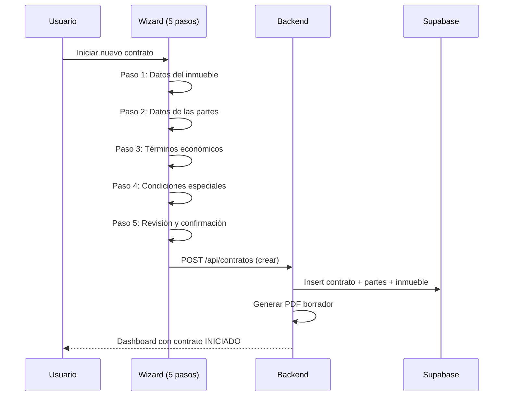
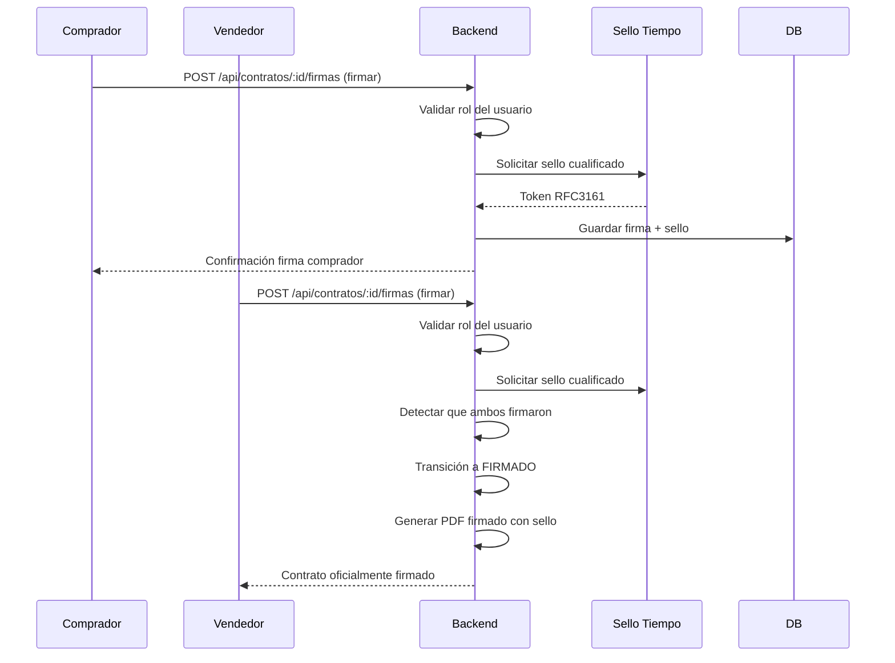
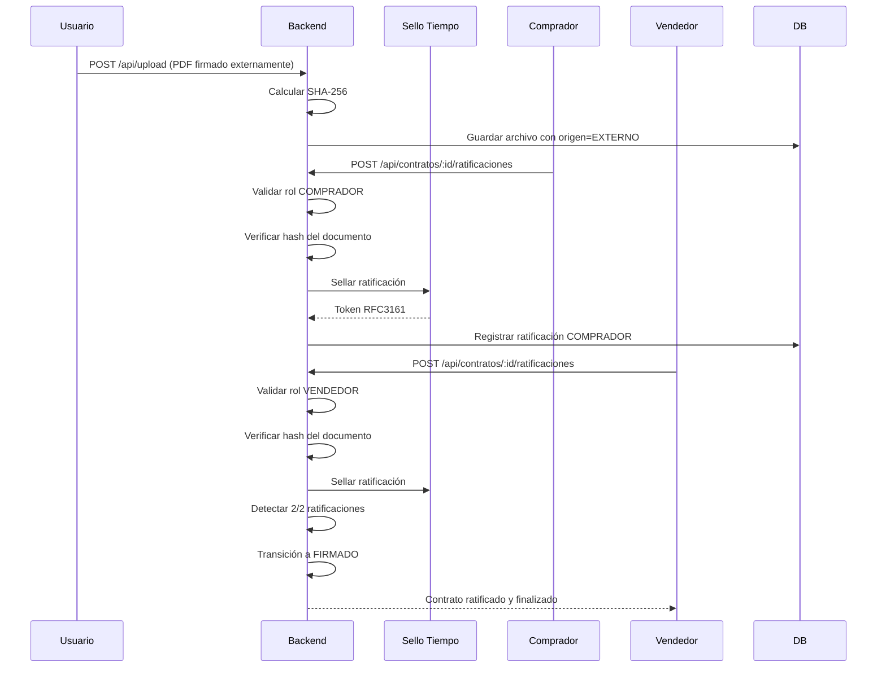
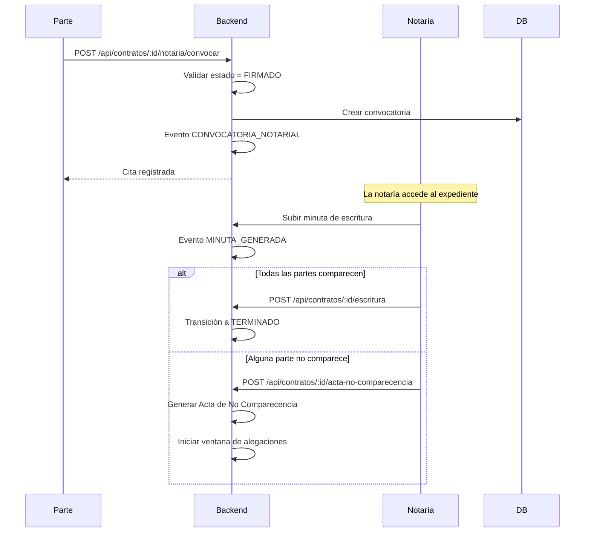
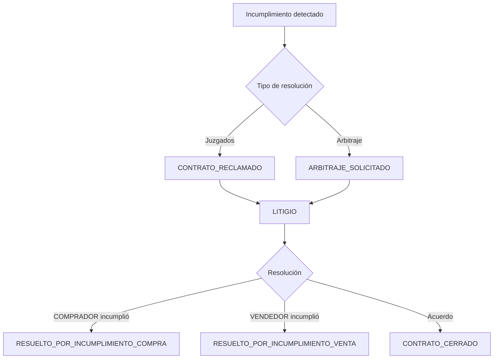
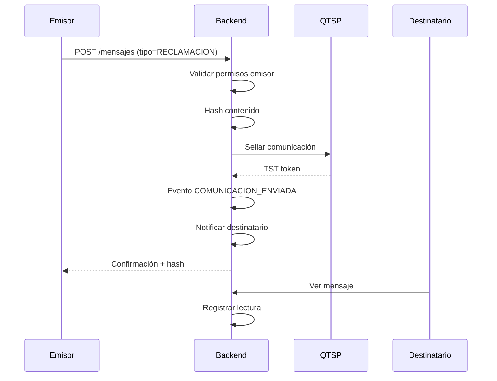
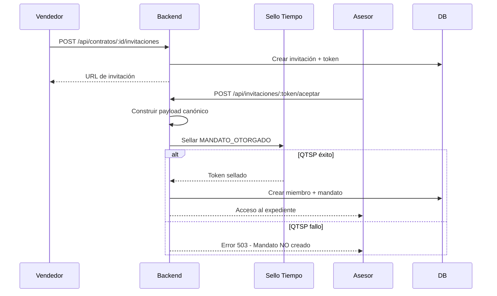

# Chrono-Flare: Sistema de Gestión de Contratos de Arras

**Plataforma SaaS para la gestión integral de contratos de arras con valor probatorio conforme a eIDAS (Reglamento UE 910/2014).**

---

## Índice

1. [Visión General](#visión-general)
2. [Estados del Contrato](#estados-del-contrato)
3. [Flujos Principales](#flujos-principales)
4. [Motor de Plantillas Contractuales](#motor-de-plantillas-contractuales)
5. [Inventario Dinámico de Documentos](#inventario-dinámico-de-documentos)
6. [Comunicaciones Estructuradas](#comunicaciones-estructuradas)
7. [Sistema de Roles y Mandatos](#sistema-de-roles-y-mandatos)
8. [Auditoría y Certificación](#auditoría-y-certificación)
9. [API Endpoints](#api-endpoints)
10. [Arquitectura Técnica](#arquitectura-técnica)

---

## Visión General

Chrono-Flare es una plataforma especializada en la gestión de contratos de arras inmobiliarios, diseñada para:

- **Partes**: Comprador y vendedor
- **Asesores**: Agencias inmobiliarias, abogados, gestorías
- **Notarías**: Acceso para preparación de escritura
- **Observadores**: Acceso de solo lectura para supervisión

### Características Principales

| Característica | Descripción |
|----------------|-------------|
| 📜 **Contratos legales** | Generación automática de contratos de arras válidos |
| ✍️ **Firma electrónica** | Firma avanzada con sellado de tiempo cualificado |
| 👥 **Gestión de participantes** | Roles, mandatos e invitaciones |
| 📁 **Gestor documental** | Clasificación y validación de documentos |
| 💬 **Comunicaciones** | Mensajería certificada entre partes |
| 📊 **Auditoría completa** | Trazabilidad de todas las acciones |
| 📄 **Certificado de eventos** | Documento probatorio con valor legal |

---

## Estados del Contrato

El contrato sigue una máquina de estados definida:

```
INICIADO → BORRADOR → FIRMADO → NOTARIA → TERMINADO
                ↓                    ↓
              (cancelar)          LITIGIO
```

| Estado | Descripción | Acciones Disponibles |
|--------|-------------|---------------------|
| `INICIADO` | Alta inicial: inmueble, partes, términos | Editar contrato, subir documentos |
| `BORRADOR` | Términos aceptados, pendiente firma | Revisar, firmar |
| `FIRMADO` | Documento firmado en plataforma | Gestionar pagos, convocar notaría |
| `NOTARIA` | Con cita en notaría para escritura | Subir escritura, marcar comparecencia |
| `TERMINADO` | Compraventa completada o cerrado | Solo consulta (expediente inmutable) |
| `LITIGIO` | En disputa por incumplimiento | Gestionar alegaciones, arbitraje |

---

## Flujos Principales

### 1. Flujo de Creación del Contrato



**Historias de usuario soportadas:**
- ✅ Como vendedor, puedo crear un contrato indicando los datos del inmueble
- ✅ Como comprador, puedo revisar los términos antes de firmar
- ✅ Como asesor, puedo crear contratos en nombre de mis clientes

> **Nota**: La generación del contrato se articula en una **Fase 1 guiada (wizard)**.
> La **Fase 2** comprende la firma electrónica y la ejecución del contrato desde el dashboard (documentación, notaría y pagos),
> y la **Fase 3** la terminación normal o litigiosa del expediente.

### 2. Flujo de Firma Electrónica

El sistema soporta dos modalidades de firma:

#### 2.1 Firma en Plataforma (In-Platform)



**Controles de seguridad (Firma por Rol):**
- ✅ Usuario solo puede firmar con su rol asignado (COMPRADOR/VENDEDOR)  
- ✅ Mandatarios pueden firmar si tienen permiso `puede_firmar`
- ✅ Backend valida `x-user-id` contra el rol solicitado
- ✅ Frontend solo muestra botón "Firmar" para el rol del usuario actual

#### 2.2 Flujo Documento Externo + Ratificación

Para contratos firmados fuera de la plataforma (físicamente o en otra herramienta):



**Texto legal de ratificación (`RATIFICACION_CONTRATO_FIRMADO_EXTERNO v1.0.0`):**

> Declaro que he revisado el documento PDF que se muestra como "Contrato de arras firmado" y reconozco que corresponde al contrato que he firmado fuera de esta plataforma.
> 
> Confirmo que:
> 1. **Reconozco como propio** el contenido íntegro de dicho documento
> 2. **Ratifico su validez y eficacia** a todos los efectos legales
> 3. **Acepto que esta ratificación electrónica quede registrada** con sellado de tiempo cualificado
> 4. Entiendo que esta actuación **refuerza probatoriamente** la firma original

#### 2.3 Panel de Preparación de Participantes

Antes de crear el borrador de contrato, el sistema verifica que las partes críticas estén invitadas:

| Estado | Icono | Descripción |
|--------|-------|-------------|
| `MIEMBRO_ACTIVO` | ✅ | Usuario ha aceptado la invitación |
| `INVITACION_PENDIENTE` | ⏳ | Invitación enviada, esperando aceptación |
| `NO_INVITADO` | ❌ | No se ha enviado invitación |

**Regla de negocio**: El botón "Crear Borrador Contrato" está bloqueado si COMPRADOR o VENDEDOR están en estado `NO_INVITADO`.

**Estados de firma:**
- `PENDIENTE`: Esperando firma
- `FIRMADO`: Firmado con sello de tiempo
- `RECHAZADO`: Firma rechazada explícitamente

**Historias de usuario soportadas:**
- ✅ Como parte, recibo notificación cuando debo firmar
- ✅ Como firmante, mi firma queda sellada con tiempo cualificado
- ✅ Como parte, puedo descargar el contrato firmado con prueba criptográfica
- ✅ Como usuario externo, puedo subir un contrato firmado fuera y ratificarlo
- ✅ Como usuario, solo veo la opción de firmar para mi rol asignado

### 3. Flujo de Gestión Documental

El sistema clasifica documentos en categorías legales:

| Categoría | Tipos de Documento |
|-----------|-------------------|
| **Inmueble** | Nota simple, Escritura anterior, Recibo IBI, Certificado comunidad |
| **Identidad** | DNI/NIE Comprador, DNI/NIE Vendedor, Poderes |
| **Contractual** | Contrato arras borrador, Contrato firmado, Justificantes pago |
| **Notaría** | Minuta escritura, Escritura compraventa, Actas |

**Flujo de validación:**
1. Usuario sube documento
2. Sistema registra evento `DOCUMENTO_SUBIDO`
3. Contraparte puede validar → `DOCUMENTO_VALIDADO`
4. O rechazar con motivo → `DOCUMENTO_RECHAZADO`

> **Ver también**: [Índice de items del inventario dinámico](#inventario-dinámico-de-documentos)

### 4. Flujo de Convocatoria Notarial



**Historias de usuario soportadas:**
- ✅ Como parte, puedo convocar cita en notaría
- ✅ Como notaría, accedo al expediente para preparar la escritura
- ✅ Como notaría, puedo subir la minuta y la escritura final
- ✅ Como sistema, detecto no comparecencia y genero acta

### 5. Flujo de No Comparecencia

Cuando una parte no acude a la cita notarial:


**Evento generado**: `ACTA_NO_COMPARECENCIA`
**Documento**: Acta formal con datos del citado, fecha/hora, testigos

### 6. Flujo de Terminación Normal

El contrato termina correctamente cuando:

1. ✅ Contrato firmado por ambas partes
2. ✅ Arras pagadas y confirmadas
3. ✅ Escritura otorgada ante notario
4. ✅ Todas las partes comparecieron

**Transición**: `NOTARIA` → `TERMINADO`
**Evento**: `ESCRITURA_OTORGADA`

### 7. Flujo de Litigio

Cuando hay incumplimiento:



**Tipos de resolución configurables:**
- `JUZGADOS`: Vía judicial ordinaria
- `ARBITRAJE_NOTARIAL`: Arbitraje ante notario

**Consecuencias según tipo de arras:**

| Tipo Arras | Si COMPRADOR incumple | Si VENDEDOR incumple |
|------------|----------------------|---------------------|
| **Penitenciales** | Pérdida de arras entregadas | Devolución por duplicado |
| **Confirmatorias** | Cumplimiento forzoso o resolución + daños | Cumplimiento forzoso o resolución + daños |
| **Penales** | Penalización pactada (sin resolver) | Penalización pactada (sin resolver) |

El **Certificado de Eventos** refleja: qué tipo de arras se pactaron, quién declaró qué incumplimiento, cuándo, y con qué comunicaciones de soporte.

---

## Motor de Plantillas Contractuales

El sistema no es un simple "merge de variables". Es un **motor de composición contractual basado en condiciones** que selecciona cláusulas según el supuesto.

### Modo Estándar Observatorio

Se utiliza el **modelo Observatorio Garrigues-ICADE** cuando:
- Objeto = vivienda
- Derecho = común
- Sin hipoteca pendiente
- Sin arrendatarios
- Arras = penitenciales

En este caso, se genera Portada + Términos Estándar sin reescribir cláusulas, solo completando casillas y corchetes.

### Plantillas Alternativas

Si las condiciones no encajan con el modo estándar, el motor activa **variantes**:

| Condición | Acción del Motor |
|-----------|------------------|
| `tipoArras = CONFIRMATORIAS` | Sustituye cláusula 5 por "arras confirmatorias" (sin desistimiento) |
| `tipoArras = PENALES` | Sustituye por "cláusula penal" |
| `objeto ≠ VIVIENDA` | Cambia 1.3 + bloque impuestos a versión "no vivienda" |
| `sinHipoteca = false` | Añade cláusula "Cancelación de cargas hipotecarias" con retención |
| `sinArrendatarios = false` | Ajusta 1.3(c): entrega libre o subrogación (según Portada) |
| `derecho = FORAL` | Añade aviso de adecuación foral en "Ley aplicable" |
| `formaPagoArras = ESCROW` | Sustituye cláusula 2.2 por pago en depósito/escrow |
| `retenciones > 0` | Añade cláusula de retenciones en bloque gastos/impuestos |
| `mobiliarioEquipamiento = true` | Añade cláusula de mobiliario con inventario anexo |

### Validación en UI (Wizard)

| Si detecta... | Entonces... |
|---------------|-------------|
| Arras ≠ penitenciales | Bloquea texto de desistimiento, activa confirmatorias/penales |
| Objeto ≠ vivienda | Activa versión "no vivienda" |
| Escrow activo | Exige datos de depositario y condiciones |
| Vivienda arrendada | Exige ficha de arrendamiento y elección entrega libre/subrogación |
| Hipoteca pendiente | Exige datos de carga y forma de cancelación |

**Implementación**: `contracts/template-utils.ts`, `pdfService.ts`

---

## Inventario Dinámico de Documentos

No es solo un "gestor de PDFs". Es un **checklist jurídico-documental** que controla qué documentación falta, quién debe aportarla, y qué transiciones bloquea.

### Estructura de Item de Inventario

```typescript
{
  id: string;
  contratoId: string;
  tipo: TipoDocumento;         // NOTA_SIMPLE, IBI, CEE, PODER_COMPRADOR...
  estado: 'PENDIENTE' | 'SUBIDO' | 'VALIDADO' | 'RECHAZADO';
  responsableRol: TipoRolUsuario;  // Quién debe subir
  archivoId?: string;          // Referencia a archivo subido
  metadatos?: {
    caducidad?: string;        // Para docs con vigencia
    csvRegistro?: string;      // Código seguro de verificación
    numeroFinca?: string;      // Para nota simple
  };
}
```

### Bloques de Documentación

#### Bloque Inmueble (responsable: VENDEDOR)

| Documento | Obligatorio | Notas |
|-----------|-------------|-------|
| Nota Simple | ✅ | Vigencia < 3 meses |
| Escritura anterior | ✅ | Título de propiedad |
| Recibo IBI | ✅ | Último pagado |
| Certificado comunidad | ✅ | Libre de deudas |
| Certificado Energético (CEE) | ✅ | Obligatorio para venta |

#### Bloque Identidad (responsable: CADA PARTE)

| Documento | Obligatorio | Notas |
|-----------|-------------|-------|
| DNI/NIE Comprador | ✅ | En vigor |
| DNI/NIE Vendedor | ✅ | En vigor |
| Poderes (si tercero) | Condicional | Si firma asesor |

#### Bloque Notaría y Escritura (responsable: NOTARIO + PARTES)

| Documento | Obligatorio | Notas |
|-----------|-------------|-------|
| Minuta escritura | ✅ | Generada por notaría |
| Escritura compraventa firmada | ✅ | Bloquea TERMINADO |
| Contrato arras firmado | ✅ | Ya en sistema |
| Justificantes de pago arras | ✅ | Anteriores a escritura |
| Certificado hipoteca cancelada | Condicional | Si había carga |
| Contrato arrendamiento | Condicional | Si vivienda ocupada |
| Inventario mobiliario | Condicional | Si se incluye mobiliario |
| Acta no comparecencia | Condicional | Si hubo |

### Gating de Transiciones

| Transición | Items requeridos en VALIDADO |
|------------|-----------------------------|
| `FIRMADO` → `NOTARIA` | Nota simple, IBI, CEE, arras pagadas |
| `NOTARIA` → `TERMINADO` | Escritura firmada |
| Litigio por no pago | Justificantes de pago ausentes |

---

## Comunicaciones Estructuradas

No es un "chat genérico". Es un **motor de comunicaciones con valor probatorio** donde cada mensaje tiene tipo, genera eventos, y se integra con otros flujos.

### Tipos de Comunicación

| Tipo | Descripción | Integra con |
|------|-------------|-------------|
| `MENSAJE_GENERAL` | Comunicación libre estructurada | — |
| `RECLAMACION` | Reclamación formal (impago, plazos, defectos) | Litigio |
| `ENTREGA_DOCUMENTACION` | Aviso de documento subido | Inventario |
| `SOLICITUD_DOCUMENTACION` | Petición de documento faltante | Inventario |
| `SOLICITUD_MODIFICACION_TERMINOS` | Propuesta de cambio contractual | Motor plantillas |
| `CONVOCATORIA_NOTARIA` | Citación formal a escritura | Notaría |
| `MODIFICACION_CITA` | Cambio de fecha/hora/lugar | Notaría |
| `ANULACION_CITA` | Cancelación de cita | Notaría |
| `NO_COMPARECENCIA_NOTIFICADA` | Aviso formal de incomparecencia | Terminación |
| `CONSECUENCIAS_NO_COMPARECENCIA` | Declaración de efectos | Litigio |
| `ALEGACIONES_NO_COMPARECENCIA` | Respuesta del no compareciente | Ventana 48h |
| `MENSAJE_SISTEMA` | Recordatorios, cambios de estado | — |
| `COMUNICACION_EXTERNA_IMPORTADA` | Email/burofax importado | Auditoría |

### Flujo de Comunicación Probatoria



### Comunicaciones + Terminación

| Fase | Comunicaciones relevantes |
|------|---------------------------|
| Pre-escritura | Convocatoria, recordatorios |
| No comparecencia | Notificación, acta, alegaciones |
| Litigio | Reclamaciones, consecuencias |
| Resolución | Acuerdo o sentencia |

Todas quedan en el **Certificado de Eventos** con hash y sello.

---

## Sistema de Roles y Mandatos

### Roles de Usuario

| Rol | Descripción | Permisos por defecto |
|-----|-------------|---------------------|
| `ADMIN` | Administrador de la plataforma | Todos |
| `COMPRADOR` | Parte compradora | Firmar, subir docs, comunicar |
| `VENDEDOR` | Parte vendedora | Firmar, subir docs, comunicar |
| `TERCERO` | Asesor autorizado (agencia/abogado) | Según mandato |
| `NOTARIO` | Notaría interviniente | Lectura, subir docs notariales |
| `OBSERVADOR` | Acceso solo lectura | Solo consulta |

### Tipos de Mandato

Cuando un TERCERO actúa en nombre de una parte:

| Mandato | Descripción |
|---------|-------------|
| `PARTE_COMPRADORA` | Asesor autorizado del comprador |
| `PARTE_VENDEDORA` | Asesor autorizado del vendedor |
| `AMBAS_PARTES` | Asesor común (mediador) |
| `NOTARIA` | Autorización a notaría |
| `OBSERVADOR_TECNICO` | Solo lectura técnica |

### Permisos Granulares

| Permiso | Descripción |
|---------|-------------|
| `puede_subir_documentos` | Subir documentación |
| `puede_invitar` | Invitar otros participantes |
| `puede_validar_documentos` | Validar/rechazar documentos |
| `puede_firmar` | Firmar en nombre de la parte |
| `puede_enviar_comunicaciones` | Enviar mensajes certificados |

### Flujo de Invitación + Mandato



**Regla estricta**: Sin sello QTSP → Sin mandato válido

Cuando un usuario actúa con mandato, la plataforma permite seleccionar explícitamente el mandato activo ("Actuando como..."). Dicha elección queda reflejada en los eventos registrados y en el **Certificado de Eventos**.

---

## Generación de Documentos

### 1. Contrato de Arras (PDF)

Generado automáticamente con:
- Datos del inmueble (dirección, referencia catastral)
- Datos de las partes (nombre, DNI, domicilio)
- Términos económicos (precio, arras, plazos)
- Condiciones especiales
- Cláusulas legales según tipo de arras

**Plantilla**: `contracts/template-utils.ts`
**Servicio**: `pdfService.ts`

### 2. Borrador de Escritura

Minuta preparatoria para notaría con:
- Resumen del contrato de arras
- Datos registrales del inmueble
- Cargas y gravámenes
- Condiciones pactadas

### 3. Acta de No Comparecencia

Documento formal que certifica:
- Citación realizada (fecha/hora/lugar)
- Parte no compareciente
- Testigos presentes
- Consecuencias legales

**Componente**: `ActaNoComparecencia.tsx`
**Servicio**: `actaService.ts`

### 4. Certificado de Eventos

Documento probatorio que incluye:
- Cronología completa de eventos
- Hash SHA-256 de cada evento
- Sellos de tiempo cualificados
- Cadena de integridad (blockchain-like)
- **Intervinientes y régimen de actuación** (sección específica que identifica para cada usuario su rol y, cuando procede, el mandato bajo el cual actuó)

**Componente**: `CertificadoEventos.tsx`
**Servicio**: `certificateService.ts`

---

## Auditoría y Certificación

### Eventos Registrados

Cada acción relevante genera un evento inmutable:

| Evento | Descripción |
|--------|-------------|
| `CONTRATO_CREADO` | Alta del contrato |
| `ACEPTACION_TERMINOS` | Parte acepta términos |
| `FIRMA_ELECTRONICA` | Firma con sello QTSP |
| `DOCUMENTO_SUBIDO` | Nuevo documento |
| `DOCUMENTO_VALIDADO` | Documento aprobado |
| `MANDATO_OTORGADO` | Nuevo mandato sellado |
| `MANDATO_REVOCADO` | Revocación sellada |
| `CONVOCATORIA_NOTARIAL` | Cita en notaría |
| `ACTA_NO_COMPARECENCIA` | No comparecencia |
| `ESCRITURA_OTORGADA` | Escritura firmada |
| `CONTRATO_CERRADO` | Cierre del expediente |
| `CONTRATO_FIRMADO_EXTERNO_SUBIDO` | PDF firmado externamente subido |
| `CONTRATO_FIRMADO_EXTERNO_RATIFICADO` | Ratificación de parte (COMPRADOR/VENDEDOR) |
| `CONTRATO_FIRMADO_FINALIZADO` | Todas las ratificaciones completadas |

### Estructura del Evento

```typescript
{
  id: string;
  contrato_id: string;
  tipo: TipoEvento;
  actor_usuario_id: string;      // Quién actuó
  actor_tipo: TipoRolUsuario;    // Con qué rol
  actor_mandato_id?: string;     // Bajo qué mandato
  actor_mandato_tipo?: string;   // Tipo de delegación
  payload_json: object;          // Datos específicos
  hash_sha256: string;           // Integridad
  prev_hash_sha256?: string;     // Encadenamiento
  sello_id: string;              // Referencia a QTSP
  fecha_hora: string;            // Timestamp servidor
}
```

### Sello de Tiempo Cualificado (QTSP)

Cada evento crítico recibe un sello RFC3161:

```typescript
{
  proveedor: string;           // Ej: "EADTrust"
  marca: string;               // Identificador único
  hash_sha256: string;         // Hash sellado
  rfc3161_tst_base64: string;  // Token completo
  fecha_sello: string;         // Hora oficial
}
```

---

## API Endpoints

### Contratos

| Método | Endpoint | Descripción |
|--------|----------|-------------|
| `GET` | `/api/contratos` | Listar contratos del usuario |
| `POST` | `/api/contratos` | Crear nuevo contrato |
| `GET` | `/api/contratos/:id` | Obtener detalle |
| `PATCH` | `/api/contratos/:id` | Actualizar contrato |
| `GET` | `/api/contratos/:id/eventos` | Timeline de eventos |
| `GET` | `/api/contratos/:id/certificado` | Generar certificado |

### Firma y Ratificación

| Método | Endpoint | Descripción |
|--------|----------|-------------|
| `GET` | `/api/contracts/:id/firmas` | Estado de firmas del contrato |
| `POST` | `/api/contracts/:id/firmar` | Registrar firma (in-platform) |
| `GET` | `/api/contratos/:id/ratificaciones` | Estado de ratificaciones |
| `POST` | `/api/contratos/:id/ratificaciones` | Ratificar documento externo |

### Participantes

| Método | Endpoint | Descripción |
|--------|----------|-------------|
| `GET` | `/api/contratos/:id/miembros` | Listar miembros |
| `POST` | `/api/contratos/:id/miembros` | Añadir miembro |
| `GET` | `/api/contratos/:id/invitaciones` | Listar invitaciones |
| `POST` | `/api/contratos/:id/invitaciones` | Crear invitación |
| `POST` | `/api/invitaciones/:token/aceptar` | Aceptar invitación |
| `PATCH` | `/api/mandatos/:id/revocar` | Revocar mandato |

### Documentos

| Método | Endpoint | Descripción |
|--------|----------|-------------|
| `GET` | `/api/contratos/:id/documentos` | Listar documentos |
| `POST` | `/api/contratos/:id/documentos` | Subir documento |
| `PATCH` | `/api/documentos/:id/validar` | Validar documento |
| `PATCH` | `/api/documentos/:id/rechazar` | Rechazar documento |

### Comunicaciones

| Método | Endpoint | Descripción |
|--------|----------|-------------|
| `GET` | `/api/contratos/:id/mensajes` | Listar mensajes |
| `POST` | `/api/contratos/:id/mensajes` | Enviar mensaje |
| `PATCH` | `/api/mensajes/:id/relevante` | Marcar relevante |

### Notaría

| Método | Endpoint | Descripción |
|--------|----------|-------------|
| `POST` | `/api/contratos/:id/notaria/convocar` | Convocar cita |
| `POST` | `/api/contratos/:id/escritura` | Registrar escritura |
| `POST` | `/api/contratos/:id/acta-no-comparecencia` | Registrar no comparecencia |

---

## Arquitectura Técnica

### Stack

| Componente | Tecnología |
|------------|------------|
| **Frontend** | React + TypeScript + Vite |
| **Backend** | Node.js + Express + TypeScript |
| **Base de datos** | Supabase (PostgreSQL) |
| **Almacenamiento** | Supabase Storage |
| **QTSP** | EADTrust (stub en desarrollo) |
| **PDF** | html2pdf.js + jsPDF |
| **Deploy** | Railway |

### Estructura de Directorios

```
chrono-flare/
├── backend/
│   ├── src/
│   │   ├── routes/          # 25 archivos de rutas
│   │   ├── services/        # 17 servicios
│   │   ├── domain/          # Lógica de negocio
│   │   ├── middleware/      # Auth, authorization
│   │   ├── utils/           # Utilidades
│   │   └── types/           # TypeScript types
│   └── migrations/          # SQL migrations
├── frontend/
│   ├── src/
│   │   ├── pages/           # Vistas principales
│   │   ├── components/      # Componentes reutilizables
│   │   ├── domain/          # Lógica de dominio
│   │   ├── contexts/        # React contexts
│   │   └── contracts/       # Plantillas de contratos
└── docs/                    # Documentación adicional
```

### Migraciones SQL Aplicadas

| Migración | Descripción |
|-----------|-------------|
| `001-019` | Core del sistema, tablas base |
| `020_roles_mandatos.sql` | miembros, mandatos, invitaciones |
| `021_eventos_mandato.sql` | actor_mandato_id/tipo en eventos |

---

## Historias de Usuario Cubiertas

### Creación de Contrato
- ✅ Crear contrato con wizard de 5 pasos
- ✅ Definir inmueble, partes, términos económicos
- ✅ Configurar tipo de arras y forma de pago
- ✅ Añadir condiciones especiales

### Firma Electrónica
- ✅ Firmar contrato con sello de tiempo cualificado
- ✅ Detectar cuando ambas partes han firmado
- ✅ Generar PDF firmado con prueba criptográfica

### Gestión Documental
- ✅ Subir documentos clasificados por tipo
- ✅ Validar o rechazar documentos subidos
- ✅ Registrar acceso a documentos

### Participantes y Delegación
- ✅ Invitar usuarios con rol y permisos
- ✅ Otorgar mandatos con sellado QTSP
- ✅ Revocar mandatos con sellado QTSP
- ✅ Selector "Actuando como..." para múltiples mandatos
- ✅ Panel de preparación de participantes antes de crear borrador

### Comunicaciones
- ✅ Enviar mensajes certificados entre partes
- ✅ Marcar mensajes como relevantes para el expediente
- ✅ Importar comunicaciones externas

### Notaría
- ✅ Convocar cita en notaría
- ✅ Subir minuta de escritura
- ✅ Registrar otorgamiento de escritura
- ✅ Generar acta de no comparecencia

### Auditoría
- ✅ Timeline completo de eventos
- ✅ Certificado de eventos con valor probatorio
- ✅ Cada evento sellado con QTSP

### Firma Externa y Ratificación
- ✅ Subir contrato firmado externamente (PDF)
- ✅ Ratificar documento con texto legal específico
- ✅ Verificación de hash SHA-256 del documento
- ✅ Transición automática a FIRMADO cuando 2/2 ratificaciones

---

## Licencia y Cumplimiento

El sistema cumple con:
- **Reglamento eIDAS (UE 910/2014)**: Sellos de tiempo cualificados
- **RGPD**: Minimización de datos, control de acceso
- **Ley 59/2003**: Firma electrónica en España

---

*Documentación actualizada: 2025-12-15*
*Versión del sistema: 1.1.0*
