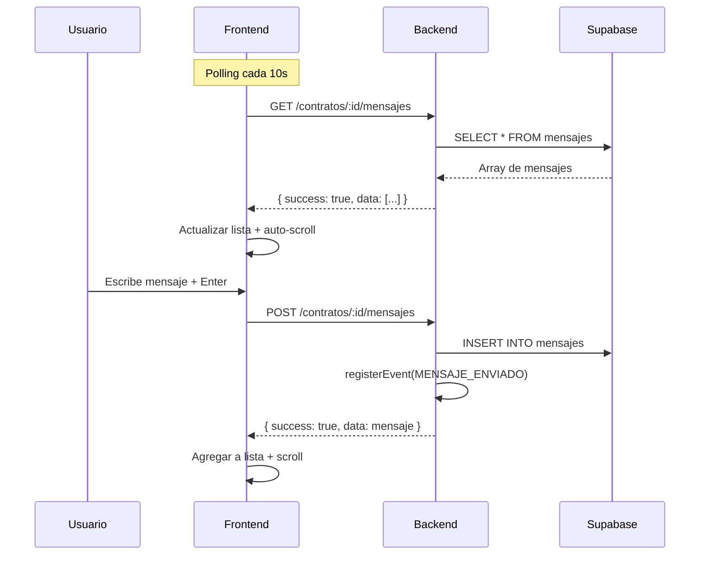
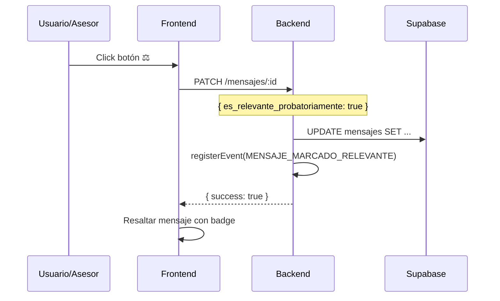

# Chat del Expediente - Chrono-Flare

Sistema de chat interno para comunicación entre participantes del expediente de contratos de arras, con funcionalidad especial de marcado probatoriamente relevante.

---

## Arquitectura

```
┌─────────────────────────────────────────────────────────────────┐
│                      FRONTEND                                    │
│  ┌─────────────────────────────────────────────────────────────┐│
│  │ ChatPanel.tsx                                               ││
│  │  - Lista de mensajes en tiempo real (polling 10s)           ││
│  │  - Envío de mensajes                                        ││
│  │  - Marcado probatoriamente relevante                        ││
│  │  - Auto-scroll al último mensaje                            ││
│  └─────────────────────────────────────────────────────────────┘│
└─────────────────────────────────────────────────────────────────┘
                              │
                              ▼
┌─────────────────────────────────────────────────────────────────┐
│                       BACKEND                                    │
│  ┌─────────────────────────────────────────────────────────────┐│
│  │ routes/chat.ts                                              ││
│  │  - GET  /contratos/:id/mensajes                             ││
│  │  - POST /contratos/:id/mensajes                             ││
│  │  - PATCH /mensajes/:id                                      ││
│  │  - GET  /contratos/:id/mensajes/relevantes                  ││
│  └─────────────────────────────────────────────────────────────┘│
│  ┌─────────────────────────────────────────────────────────────┐│
│  │ services/eventService.ts                                    ││
│  │  - Registro de eventos MENSAJE_ENVIADO                      ││
│  │  - Registro de eventos MENSAJE_MARCADO_RELEVANTE            ││
│  └─────────────────────────────────────────────────────────────┘│
└─────────────────────────────────────────────────────────────────┘
                              │
                              ▼
┌─────────────────────────────────────────────────────────────────┐
│                     SUPABASE                                     │
│  ┌────────────────┐  ┌────────────────┐                         │
│  │ mensajes       │  │ eventos        │                         │
│  └────────────────┘  └────────────────┘                         │
└─────────────────────────────────────────────────────────────────┘
```

---

## Funcionalidades

### 1. Mensajería en Tiempo Real

| Característica | Descripción |
|----------------|-------------|
| **Polling** | Actualización cada 10 segundos |
| **Auto-scroll** | Scroll automático al último mensaje |
| **Envío rápido** | Enter para enviar, Shift+Enter para nueva línea |
| **Estados** | Loading, empty, sending |

### 2. Tipos de Mensaje

| Tipo | Icono | Descripción |
|------|-------|-------------|
| **Usuario** | 👤 | Mensaje de participante |
| **Sistema** | 🤖 | Notificación automática |

### 3. Marcado Probatoriamente Relevante ⚖️

Funcionalidad única que permite marcar mensajes como **evidencia probatoria** para el expediente legal:

```
┌──────────────────────────────────────────────────────────────┐
│ 👤 Comprador                                    15/01 10:30  │
│ ────────────────────────────────────────────────────────────│
│ Me comprometo a realizar el pago de las arras              │
│ antes del viernes 20 de enero                              │
│ ────────────────────────────────────────────────────────────│
│ ⚖️ Relevante Probatoriamente                        [⚖️]   │
└──────────────────────────────────────────────────────────────┘
```

Al marcar un mensaje:
- Se registra fecha y hora del marcado
- Se genera evento `MENSAJE_MARCADO_RELEVANTE`
- Queda incluido en certificado de eventos

---

## Componente Frontend

### Props

```typescript
interface ChatPanelProps {
  contratoId: string;        // ID del expediente
  usuarioNombre?: string;    // Nombre del usuario actual
}
```

### Uso

```tsx
<ChatPanel 
  contratoId="uuid-del-contrato" 
  usuarioNombre="Juan Pérez" 
/>
```

### Estados del Mensaje

```typescript
interface Mensaje {
  id: string;
  mensaje: string;
  remitente_nombre: string;
  es_sistema: boolean;                    // true = mensaje del sistema
  es_relevante_probatoriamente: boolean;  // true = marcado como evidencia
  motivo_relevancia?: string;             // Motivo del marcado
  created_at: string;                     // ISO timestamp
}
```

---

## API Endpoints

### Listar Mensajes

```http
GET /api/contratos/:contratoId/mensajes
```

**Respuesta:**
```json
{
  "success": true,
  "data": [
    {
      "id": "uuid",
      "contrato_id": "uuid",
      "mensaje": "Hola, confirmo recepción de documentos",
      "remitente_id": "uuid",
      "remitente_nombre": "Juan Pérez",
      "es_sistema": false,
      "es_relevante_probatoriamente": false,
      "created_at": "2025-01-15T10:30:00Z"
    }
  ],
  "count": 15
}
```

### Enviar Mensaje

```http
POST /api/contratos/:contratoId/mensajes
Content-Type: application/json

{
  "mensaje": "Confirmo la fecha de firma para el lunes",
  "remitente_nombre": "Ana García",
  "remitente_id": "uuid-opcional",
  "es_sistema": false,
  "metadatos": {}
}
```

**Respuesta:**
```json
{
  "success": true,
  "data": {
    "id": "uuid-nuevo",
    "mensaje": "Confirmo la fecha de firma para el lunes",
    "remitente_nombre": "Ana García",
    "es_sistema": false,
    "es_relevante_probatoriamente": false,
    "created_at": "2025-01-15T11:45:00Z"
  }
}
```

### Marcar como Relevante

```http
PATCH /api/mensajes/:mensajeId
Content-Type: application/json

{
  "es_relevante_probatoriamente": true,
  "motivo_relevancia": "Compromiso de pago del comprador"
}
```

### Listar Solo Relevantes

```http
GET /api/contratos/:contratoId/mensajes/relevantes
```

Retorna solo mensajes marcados como probatoriamente relevantes.

---

## Tabla de Base de Datos

### `mensajes`

| Campo | Tipo | Descripción |
|-------|------|-------------|
| `id` | UUID | PK |
| `contrato_id` | UUID | FK a contratos_arras |
| `mensaje` | TEXT | Contenido del mensaje |
| `remitente_id` | UUID | ID del usuario (opcional) |
| `remitente_nombre` | TEXT | Nombre del remitente |
| `es_sistema` | BOOLEAN | true si es mensaje automático |
| `metadatos` | JSONB | Datos adicionales |
| `es_relevante_probatoriamente` | BOOLEAN | Marcado como evidencia |
| `fecha_marcado_relevante` | TIMESTAMPTZ | Cuándo se marcó |
| `motivo_relevancia` | TEXT | Razón del marcado |
| `created_at` | TIMESTAMPTZ | Fecha de creación |
| `updated_at` | TIMESTAMPTZ | Última actualización |

### Índices

```sql
-- Mensajes por contrato
CREATE INDEX idx_mensajes_contrato ON mensajes(contrato_id);

-- Solo mensajes relevantes (índice parcial)
CREATE INDEX idx_mensajes_relevantes 
  ON mensajes(contrato_id, es_relevante_probatoriamente) 
  WHERE es_relevante_probatoriamente = true;

-- Ordenamiento por fecha
CREATE INDEX idx_mensajes_created ON mensajes(created_at);
```

---

## Eventos Registrados

| Evento | Descripción | Payload |
|--------|-------------|---------|
| `MENSAJE_ENVIADO` | Nuevo mensaje de usuario | `mensaje_id`, `remitente`, `preview` |
| `MENSAJE_MARCADO_RELEVANTE` | Mensaje marcado como evidencia | `mensaje_id`, `motivo`, `mensaje_preview` |

### Ejemplo de Evento

```json
{
  "tipo": "MENSAJE_MARCADO_RELEVANTE",
  "contrato_id": "uuid",
  "payload": {
    "mensaje_id": "uuid",
    "motivo": "Compromiso de fecha de pago",
    "mensaje_preview": "Me comprometo a pagar el día 20..."
  },
  "fecha_hora": "2025-01-15T12:00:00Z"
}
```

---

## Flujo de Mensajes



---

## Flujo de Marcado Relevante



---

## Estilos CSS

### Clases Principales

| Clase | Descripción |
|-------|-------------|
| `.chat-panel` | Contenedor principal |
| `.chat-header` | Cabecera con título y contador |
| `.chat-messages` | Área de mensajes scrollable |
| `.mensaje` | Mensaje individual |
| `.mensaje.sistema` | Mensaje del sistema |
| `.mensaje.relevante` | Mensaje marcado como relevante |
| `.chat-input-area` | Área de entrada de texto |

### Estados Visuales

```css
/* Mensaje normal */
.mensaje { ... }

/* Mensaje del sistema */
.mensaje.sistema {
  background: var(--color-info-light);
  border-left: 3px solid var(--color-info);
}

/* Mensaje marcado como relevante */
.mensaje.relevante {
  background: var(--color-warning-light);
  border-left: 3px solid var(--color-warning);
}
```

---

## Casos de Uso Probatorio

### Cuándo Marcar un Mensaje

| Situación | Marcar? | Motivo Sugerido |
|-----------|---------|-----------------|
| Compromiso de pago | ✅ | "Compromiso fecha/importe pago" |
| Confirmación de fecha firma | ✅ | "Confirmación fecha escritura" |
| Aceptación de condiciones | ✅ | "Aceptación términos contrato" |
| Renuncia de derechos | ✅ | "Renuncia expresa a..." |
| Notificación de incumplimiento | ✅ | "Notificación incumplimiento plazo" |
| Conversación casual | ❌ | - |
| Preguntas informativas | ❌ | - |

---

## Integración con Certificado de Eventos

Los mensajes marcados como relevantes se incluyen en el **Certificado de Eventos** del expediente:

```
CERTIFICADO DE EVENTOS - EXPEDIENTE ARRAS-2025-001
═══════════════════════════════════════════════════

[...]

📨 MENSAJE MARCADO RELEVANTE
   Fecha: 15/01/2025 12:00
   Remitente: Comprador (Juan Pérez)
   Contenido: "Me comprometo a realizar el pago de las arras 
              antes del viernes 20 de enero"
   Motivo: Compromiso de fecha de pago
   Hash: a1b2c3d4e5f6...
   Sellado QTSP: ✅

[...]
```

---

## Permisos

| Acción | Comprador | Vendedor | Asesor | Notario |
|--------|-----------|----------|--------|---------|
| Ver mensajes | ✅ | ✅ | ✅ | ✅ |
| Enviar mensajes | ✅ | ✅ | ✅ | ✅ |
| Marcar relevante | ⚠️ Limitado | ⚠️ Limitado | ✅ | ✅ |
