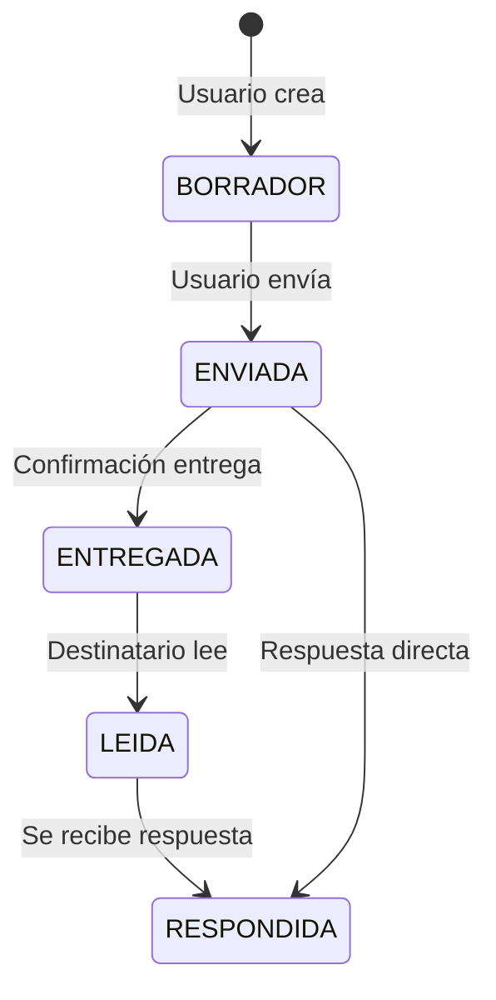

# Centro de Comunicaciones - Chrono-Flare

Sistema de gestión de comunicaciones internas y externas para expedientes de contratos de arras con trazabilidad criptográfica y sellado QTSP.

---

## Arquitectura

```
┌─────────────────────────────────────────────────────────────────┐
│                      FRONTEND                                    │
│  ┌─────────────────────────────────────────────────────────────┐│
│  │ GestorComunicaciones.tsx                                    ││
│  │  - Listado con filtros por tipo, canal y origen             ││
│  │  - Estadísticas (total, internas, externas, pendientes)     ││
│  │  - Modal de detalle                                         ││
│  └─────────────────────────────────────────────────────────────┘│
│  ┌───────────────────┐  ┌───────────────────┐  ┌──────────────┐│
│  │ FormularioRecla-  │  │ FormularioSoli-   │  │ Formulario-  ││
│  │ macion.tsx        │  │ citudDoc.tsx      │  │ Convocatoria ││
│  └───────────────────┘  └───────────────────┘  └──────────────┘│
│  ┌─────────────────────────────────────────────────────────────┐│
│  │ ImportarExterna.tsx                                         ││
│  │  - Importar comunicaciones de canales externos              ││
│  └─────────────────────────────────────────────────────────────┘│
└─────────────────────────────────────────────────────────────────┘
                              │
                              ▼
┌─────────────────────────────────────────────────────────────────┐
│                       BACKEND                                    │
│  ┌─────────────────────────────────────────────────────────────┐│
│  │ communicationService.ts                                     ││
│  │  - Comunicaciones internas estructuradas                    ││
│  │  - Importación de externas                                  ││
│  │  - Hash SHA-256 del contenido                               ││
│  │  - Sellado QTSP (RFC 3161)                                  ││
│  │  - Registro de eventos                                      ││
│  └─────────────────────────────────────────────────────────────┘│
│  ┌─────────────────────────────────────────────────────────────┐│
│  │ notificationService.ts                                      ││
│  │  - Webhooks de notificación (n8n)                           ││
│  │  - Triggers de comunicaciones                               ││
│  └─────────────────────────────────────────────────────────────┘│
└─────────────────────────────────────────────────────────────────┘
                              │
                              ▼
┌─────────────────────────────────────────────────────────────────┐
│                     SUPABASE                                     │
│  ┌────────────────┐  ┌────────────────┐  ┌───────────────────┐  │
│  │ comunicaciones │  │ sellos_tiempo  │  │ contratos_arras   │  │
│  └────────────────┘  └────────────────┘  └───────────────────┘  │
└─────────────────────────────────────────────────────────────────┘
```

---

## Tipos de Comunicación

| Tipo | Icono | Descripción |
|------|-------|-------------|
| `RECLAMACION` | ⚠️ | Reclamación formal de una parte |
| `SOLICITUD_DOCUMENTACION` | 📄 | Solicitud de documentos específicos |
| `NOTIFICACION_GENERAL` | 📢 | Notificación informativa |
| `CONVOCATORIA_NOTARIA` | ⚖️ | Convocatoria para firma en notaría |
| `ALEGACION` | 💬 | Alegación o respuesta extensa |
| `RESPUESTA` | ↩️ | Respuesta a otra comunicación |
| `COMUNICACION_EXTERNA_IMPORTADA` | 📥 | Comunicación externa importada |

---

## Canales de Comunicación

| Canal | Icono | Uso |
|-------|-------|-----|
| `PLATAFORMA` | 🖥️ | Interno via Chrono-Flare |
| `EMAIL` | 📧 | Correo electrónico |
| `BUROFAX` | 📮 | Burofax certificado |
| `CARTA_CERTIFICADA` | 📬 | Correo certificado |
| `CARTA_SIMPLE` | ✉️ | Correo ordinario |
| `WHATSAPP` | 💬 | Mensajería instantánea |
| `TELEFONO` | 📞 | Conversación telefónica |
| `OTRO` | 📋 | Otros canales |

---

## Estados de Comunicación



| Estado | Icono | Color | Descripción |
|--------|-------|-------|-------------|
| `BORRADOR` | 📝 | `#718096` | Aún no enviada |
| `ENVIADA` | 📤 | `#4299e1` | Enviada, pendiente entrega |
| `ENTREGADA` | 📬 | `#38a169` | Confirmación de entrega |
| `LEIDA` | 👁️ | `#9f7aea` | Leída por destinatario |
| `RESPONDIDA` | ↩️ | `#ed8936` | Con respuesta |

---

## Flujo de Trabajo

### Comunicación Interna (Plataforma)

1. **Creación**: Usuario crea comunicación estructurada
2. **Hash**: Se calcula hash SHA-256 del contenido
3. **Envío**: Si `enviarInmediatamente = true`:
   - Sella con QTSP (timestamp cualificado)
   - Registra evento `COMUNICACION_ENVIADA`
   - Dispara webhook de notificación
4. **Ciclo de vida**: BORRADOR → ENVIADA → ENTREGADA → LEIDA → RESPONDIDA

### Comunicación Externa (Importación)

1. **Importación**: Usuario registra comunicación recibida por otro canal
2. **Datos**: Fecha original, remitente externo, resumen
3. **Hash canónico**: Se crea JSON normalizado y se calcula hash
4. **Sellado**: Se sella con QTSP inmediatamente
5. **Estado**: Externas siempre están en `ENVIADA`

---

## API Endpoints

### Listar Comunicaciones

```http
GET /api/contratos/:contratoId/comunicaciones
```

**Respuesta:**
```json
{
  "success": true,
  "data": [
    {
      "id": "uuid",
      "contrato_id": "uuid",
      "tipo_comunicacion": "RECLAMACION",
      "canal": "PLATAFORMA",
      "remitente_rol": "COMPRADOR",
      "destinatarios_roles": ["VENDEDOR", "ASESOR_VENDEDOR"],
      "asunto": "Incumplimiento plazo documentación",
      "contenido": "Por la presente comunico...",
      "fecha_comunicacion": "2025-01-15T10:30:00Z",
      "estado": "ENVIADA",
      "es_externa": false,
      "adjuntos_archivo_ids": ["uuid"],
      "hash_contenido": "sha256...",
      "sello_qtsp_id": "uuid"
    }
  ]
}
```

### Crear Comunicación Interna

```http
POST /api/contratos/:contratoId/comunicaciones
Content-Type: application/json

{
  "tipoComunicacion": "RECLAMACION",
  "remitenteRol": "COMPRADOR",
  "destinatariosRoles": ["VENDEDOR"],
  "asunto": "Reclamación: Plazo vencido",
  "contenido": "Por la presente comunico que...",
  "adjuntosArchivoIds": [],
  "enviarInmediatamente": true
}
```

**Respuesta:**
```json
{
  "success": true,
  "comunicacion": {
    "id": "uuid",
    "hashContenido": "sha256...",
    "selloQtspId": "uuid",
    "estado": "ENVIADA"
  }
}
```

### Importar Comunicación Externa

```http
POST /api/contratos/:contratoId/comunicaciones/externa
Content-Type: application/json

{
  "canal": "BUROFAX",
  "fechaComunicacion": "2025-01-10T09:00:00Z",
  "remitenteExterno": "Banco Hipotecario S.A.",
  "resumenContenido": "Comunicación de aprobación de hipoteca...",
  "tipoFuncion": "RESPUESTA_HIPOTECA",
  "adjuntosArchivoIds": ["uuid-archivo-burofax"],
  "registradoPorRol": "ASESOR_COMPRADOR"
}
```

### Responder a Comunicación

```http
POST /api/comunicaciones/:comunicacionId/responder
Content-Type: application/json

{
  "remitenteRol": "VENDEDOR",
  "contenido": "En respuesta a su comunicación...",
  "enviarInmediatamente": true
}
```

### Marcar como Leída

```http
POST /api/comunicaciones/:comunicacionId/leer
```

### Enviar Borrador

```http
POST /api/comunicaciones/:comunicacionId/enviar
```

---

## Tabla de Base de Datos

### `comunicaciones`

| Campo | Tipo | Descripción |
|-------|------|-------------|
| `id` | UUID | PK |
| `contrato_id` | UUID | FK a contratos_arras |
| `tipo_comunicacion` | VARCHAR | RECLAMACION, SOLICITUD_DOCUMENTACION, etc. |
| `tipo_funcion` | VARCHAR | Subtipo (para externas) |
| `canal` | VARCHAR | PLATAFORMA, EMAIL, BUROFAX, etc. |
| `remitente_rol` | VARCHAR | Rol del remitente (si interna) |
| `remitente_externo` | TEXT | Nombre remitente (si externa) |
| `destinatarios_roles` | TEXT[] | Array de roles destinatarios |
| `destinatarios_externos` | TEXT | Destinatarios externos |
| `asunto` | TEXT | Asunto de la comunicación |
| `contenido` | TEXT | Contenido completo |
| `contenido_html` | TEXT | Versión HTML |
| `resumen_externo` | TEXT | Resumen (para externas) |
| `fecha_comunicacion` | TIMESTAMPTZ | Fecha original |
| `fecha_registro` | TIMESTAMPTZ | Fecha de registro en sistema |
| `fecha_envio` | TIMESTAMPTZ | Fecha de envío |
| `fecha_entrega` | TIMESTAMPTZ | Fecha de entrega |
| `fecha_lectura` | TIMESTAMPTZ | Fecha de lectura |
| `estado` | VARCHAR | BORRADOR, ENVIADA, ENTREGADA, LEIDA, RESPONDIDA |
| `es_externa` | BOOLEAN | true si es importada |
| `comunicacion_padre_id` | UUID | FK para hilos |
| `adjuntos_archivo_ids` | UUID[] | Array de archivos adjuntos |
| `hash_contenido` | VARCHAR(64) | SHA-256 del contenido |
| `sello_qtsp_id` | UUID | FK a sellos_tiempo |
| `metadatos` | JSONB | Datos adicionales |

---

## Funciones del Servicio

### `createCommunication(params)`

Crea una comunicación interna:
1. Calcula hash SHA-256 del contenido
2. Determina estado (BORRADOR o ENVIADA)
3. Guarda en DB
4. Si `enviarInmediatamente`:
   - Sella con QTSP
   - Registra evento
   - Dispara webhook

### `importExternalCommunication(params)`

Importa comunicación externa:
1. Valida resumen (mín. 10 caracteres)
2. Crea JSON canónico y calcula hash
3. Guarda con `es_externa = true`
4. Sella con QTSP (siempre)
5. Registra evento `COMUNICACION_EXTERNA_IMPORTADA`
6. Dispara webhook

### `sendCommunication(comunicacionId)`

Envía un borrador:
1. Verifica estado BORRADOR
2. Actualiza a ENVIADA
3. Sella con QTSP
4. Registra evento

### `respondToCommunication(padreId, respuesta)`

Responde a comunicación:
1. Crea nueva comunicación tipo RESPUESTA
2. Vincula a comunicación padre
3. Marca padre como RESPONDIDA

### `markAsDelivered(id)` / `markAsRead(id)`

Actualiza estado y fecha correspondiente.

### `getConversationThread(id)`

Obtiene hilo completo de una conversación.

### `listCommunications(contratoId, filters)`

Lista con filtros: tipo, canal, estado, esExterna.

---

## Componente Frontend

### Props
```typescript
interface GestorComunicacionesProps {
  contratoId: string;
  rolActual: string;  // COMPRADOR, VENDEDOR, ASESOR_*, NOTARIO
}
```

### Uso
```tsx
<GestorComunicaciones 
  contratoId="uuid-del-contrato" 
  rolActual="ASESOR_COMPRADOR" 
/>
```

### Modales Disponibles

| Modal | Función |
|-------|---------|
| **FormularioReclamacion** | Crear reclamación formal |
| **FormularioSolicitudDoc** | Solicitar documentos específicos |
| **FormularioConvocatoria** | Convocar a notaría |
| **ImportarExterna** | Registrar comunicación de otro canal |

---

## Seguridad y Trazabilidad

### Hash SHA-256
Cada comunicación tiene un hash calculado:
```typescript
const hashContenido = createHash('sha256')
  .update(contenido)
  .digest('hex');
```

### JSON Canónico (Externas)
Para externas, se crea un JSON normalizado antes del hash:
```json
{
  "tipo": "COMUNICACION_EXTERNA_IMPORTADA",
  "canal": "BUROFAX",
  "fecha_comunicacion": "2025-01-10T09:00:00Z",
  "remitente_externo": "Banco S.A.",
  "resumen": "...",
  "adjuntos": [...],
  "fecha_registro": "2025-01-15T10:30:00Z"
}
```

### Sellado QTSP (RFC 3161)
- Comunicaciones enviadas se sellan con timestamp cualificado
- Comunicaciones externas se sellan inmediatamente al importar
- Almacenado en tabla `sellos_tiempo`

### Webhooks (n8n)
Eventos que disparan webhooks:
- `COMUNICACION_ENVIADA`
- `COMUNICACION_EXTERNA_IMPORTADA`

---

## Integración con n8n

Workflow: `n8n-workflows/comunicaciones-workflow.json`

```
┌─────────────┐     ┌─────────────┐     ┌─────────────┐
│  Webhook    │────▶│  Procesar   │────▶│  Notificar  │
│  Trigger    │     │  Evento     │     │  Email/SMS  │
└─────────────┘     └─────────────┘     └─────────────┘
```

---

## Permisos por Rol

| Acción | Comprador | Vendedor | Asesor | Notario |
|--------|-----------|----------|--------|---------|
| Ver comunicaciones | ✅ Sus comunicaciones | ✅ Sus comunicaciones | ✅ Todas | ✅ Todas |
| Crear comunicación | ✅ | ✅ | ✅ | ✅ |
| Importar externa | ❌ | ❌ | ✅ | ✅ |
| Responder | ✅ | ✅ | ✅ | ✅ |
| Convocar notaría | ❌ | ❌ | ❌ | ✅ |
