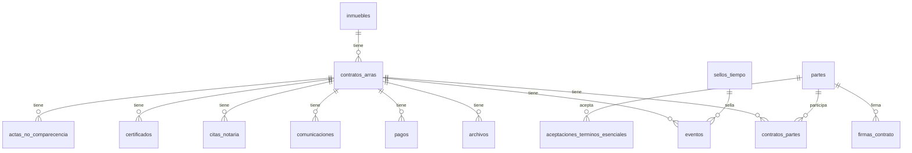

# Modelo de Datos - Chrono-Flare

Documentación completa del modelo de datos para ingesta de datos de test.

---

## Diagrama de Relaciones



---

## Tablas Principales

### 1. `inmuebles`

Datos del inmueble objeto del contrato.

| Campo | Tipo | Nullable | Descripción |
|-------|------|----------|-------------|
| `id` | UUID | ❌ | PK auto-generado |
| `direccion_completa` | TEXT | ❌ | Dirección completa |
| `codigo_postal` | VARCHAR(10) | ✅ | CP |
| `ciudad` | VARCHAR(100) | ❌ | Ciudad |
| `provincia` | VARCHAR(100) | ❌ | Provincia |
| `identificador_catastral` | VARCHAR(50) | ✅ | Referencia catastral |
| `referencia_catastral` | VARCHAR(50) | ✅ | Alias catastral |
| `datos_registrales` | TEXT | ✅ | Datos del Registro de la Propiedad |
| `titulo_adquisicion_vendedor` | TEXT | ✅ | Título por el que adquirió el vendedor |
| `nota_simple_csv` | TEXT | ✅ | CSV de la nota simple |
| `nota_simple_fecha` | DATE | ✅ | Fecha de la nota simple |
| `url_anuncio` | TEXT | ✅ | URL del anuncio inmobiliario |
| `datos_descripcion` | TEXT | ✅ | Descripción adicional |
| `m2` | DECIMAL(10,2) | ✅ | Metros cuadrados |
| `habitaciones` | INTEGER | ✅ | Número de habitaciones |
| `banos` | INTEGER | ✅ | Número de baños |
| `created_at` | TIMESTAMPTZ | ❌ | Auto |
| `updated_at` | TIMESTAMPTZ | ❌ | Auto |

**Ejemplo JSON:**
```json
{
  "direccion_completa": "Calle Gran Vía 45, 3º A",
  "codigo_postal": "28013",
  "ciudad": "Madrid",
  "provincia": "Madrid",
  "referencia_catastral": "9872023VK4797S0001WX",
  "m2": 95.5,
  "habitaciones": 3,
  "banos": 2
}
```

---

### 2. `partes`

Personas físicas o jurídicas que participan en el contrato.

| Campo | Tipo | Nullable | Valores | Descripción |
|-------|------|----------|---------|-------------|
| `id` | UUID | ❌ | | PK |
| `rol` | VARCHAR(20) | ❌ | COMPRADOR, VENDEDOR, INTERMEDIARIO, OTRO | Rol principal |
| `nombre` | VARCHAR(100) | ❌ | | Nombre |
| `apellidos` | VARCHAR(200) | ❌ | | Apellidos |
| `estado_civil` | VARCHAR(50) | ✅ | | Soltero, Casado, etc. |
| `tipo_documento` | VARCHAR(20) | ❌ | DNI, NIE, PASAPORTE, CIF | Tipo identificación |
| `numero_documento` | VARCHAR(50) | ❌ | | Número documento |
| `email` | VARCHAR(200) | ❌ | | Email |
| `telefono` | VARCHAR(20) | ✅ | | Teléfono |
| `domicilio` | TEXT | ✅ | | Dirección de notificaciones |
| `es_representante` | BOOLEAN | ❌ | | ¿Actúa en representación? |
| `representa_a` | UUID | ✅ | | FK a otra parte |

**Ejemplo JSON:**
```json
{
  "rol": "COMPRADOR",
  "nombre": "María",
  "apellidos": "García López",
  "estado_civil": "Casada",
  "tipo_documento": "DNI",
  "numero_documento": "12345678A",
  "email": "maria.garcia@email.com",
  "telefono": "+34612345678",
  "domicilio": "Calle Serrano 100, Madrid",
  "es_representante": false
}
```

---

### 3. `contratos_arras`

Tabla principal del contrato de arras.

| Campo | Tipo | Nullable | Valores | Descripción |
|-------|------|----------|---------|-------------|
| `id` | UUID | ❌ | | PK |
| `inmueble_id` | UUID | ❌ | | FK a inmuebles |
| `estado` | VARCHAR(50) | ❌ | Ver abajo | Estado del expediente |
| `tipo_arras` | VARCHAR(20) | ❌ | CONFIRMATORIAS, PENITENCIALES, PENALES, OTRO | Tipo legal |
| `precio_total` | DECIMAL(15,2) | ❌ | | Precio de compraventa |
| `importe_arras` | DECIMAL(15,2) | ❌ | | Importe de las arras |
| `porcentaje_arras_calculado` | DECIMAL(5,2) | ❌ | | % arras sobre precio |
| `moneda` | VARCHAR(3) | ❌ | EUR | Moneda |
| `fecha_limite_firma_escritura` | TIMESTAMPTZ | ❌ | | Fecha límite escritura |
| `forma_pago_arras` | VARCHAR(20) | ❌ | AL_FIRMAR, POSTERIOR, ESCROW | Cuándo se pagan |
| `plazo_pago_arras_dias` | INTEGER | ✅ | | Días para pagar arras |
| `iban_vendedor` | VARCHAR(34) | ✅ | | IBAN para transferencia |
| `banco_vendedor` | VARCHAR(100) | ✅ | | Nombre del banco |
| `notario_designado_nombre` | VARCHAR(200) | ✅ | | Nombre del notario |
| `notario_designado_direccion` | TEXT | ✅ | | Dirección notaría |
| `gastos_quien` | VARCHAR(20) | ✅ | LEY, COMPRADOR | Quién paga gastos |
| `via_resolucion` | VARCHAR(30) | ✅ | JUZGADOS, ARBITRAJE_NOTARIAL | Resolución conflictos |
| `firma_preferida` | VARCHAR(20) | ✅ | ELECTRONICA, MANUSCRITA | Tipo de firma |
| `condicion_suspensiva_texto` | TEXT | ✅ | | Condiciones suspensivas |
| `observaciones` | TEXT | ✅ | | Notas adicionales |
| `version_hash` | VARCHAR(64) | ❌ | | Hash SHA256 del contenido |
| `version_numero` | INTEGER | ❌ | | Número de versión |
| `identificador_unico` | UUID | ❌ | | ID público del contrato |
| `arras_acreditadas_at` | TIMESTAMPTZ | ✅ | | Fecha de acreditación |
| `motivo_cierre` | VARCHAR(50) | ✅ | | Si cerrado, motivo |

**Estados del contrato:**
| Estado | Descripción |
|--------|-------------|
| `INICIADO` | Alta inicial del inmueble y partes |
| `BORRADOR` | Términos pendientes de firma |
| `FIRMADO` | Contrato firmado electrónicamente |
| `NOTARIA` | Con cita notarial programada |
| `TERMINADO` | Compraventa completada |
| `LITIGIO` | En disputa |

**Ejemplo JSON:**
```json
{
  "inmueble_id": "uuid-del-inmueble",
  "estado": "BORRADOR",
  "tipo_arras": "PENITENCIALES",
  "precio_total": 350000.00,
  "importe_arras": 35000.00,
  "porcentaje_arras_calculado": 10.00,
  "moneda": "EUR",
  "fecha_limite_firma_escritura": "2025-06-15T10:00:00Z",
  "forma_pago_arras": "AL_FIRMAR",
  "gastos_quien": "LEY",
  "via_resolucion": "JUZGADOS",
  "firma_preferida": "ELECTRONICA",
  "version_hash": "a1b2c3...",
  "version_numero": 1
}
```

---

### 4. `contratos_partes`

Relación many-to-many entre contratos y partes.

| Campo | Tipo | Nullable | Descripción |
|-------|------|----------|-------------|
| `id` | UUID | ❌ | PK |
| `contrato_id` | UUID | ❌ | FK a contratos_arras |
| `parte_id` | UUID | ❌ | FK a partes |
| `rol_en_contrato` | VARCHAR(50) | ❌ | Rol específico en este contrato |
| `obligado_aceptar` | BOOLEAN | ❌ | ¿Debe aceptar términos? |
| `obligado_firmar` | BOOLEAN | ❌ | ¿Debe firmar? |
| `porcentaje_propiedad` | DECIMAL(5,2) | ✅ | % de propiedad (ej: 50%) |

---

### 5. `eventos`

Cadena de eventos con hash para auditoría.

| Campo | Tipo | Nullable | Descripción |
|-------|------|----------|-------------|
| `id` | UUID | ❌ | PK |
| `contrato_id` | UUID | ❌ | FK |
| `tipo` | VARCHAR(50) | ❌ | Tipo de evento (ver lista) |
| `actor_parte_id` | UUID | ✅ | Quién realizó la acción |
| `payload_json` | JSONB | ❌ | Datos del evento |
| `hash_sha256` | VARCHAR(64) | ❌ | Hash del evento |
| `prev_hash_sha256` | VARCHAR(64) | ✅ | Hash del evento anterior |
| `fecha_hora` | TIMESTAMPTZ | ❌ | Timestamp |
| `sello_id` | UUID | ✅ | FK a sello QTSP |

**Tipos de evento principales:**
- `CONTRATO_CREADO`, `BORRADOR_GENERADO`, `TERMINOS_ACEPTADOS`
- `FIRMA_REGISTRADA`, `FIRMA_ELECTRONICA`, `CONTRATO_FIRMADO`
- `ARRAS_DECLARADAS`, `ARRAS_ACREDITADAS`, `PAGO_ARRAS_CONFIRMADO`
- `DOCUMENTO_SUBIDO`, `DOCUMENTO_VALIDADO`, `DOCUMENTO_RECHAZADO`
- `COMUNICACION_ENVIADA`, `COMUNICACION_LEIDA`
- `CONVOCATORIA_NOTARIAL`, `ESCRITURA_OTORGADA`
- `CONTRATO_CERRADO`, `CONTRATO_RECLAMADO`

---

### 6. `archivos`

Documentos subidos al expediente.

| Campo | Tipo | Nullable | Descripción |
|-------|------|----------|-------------|
| `id` | UUID | ❌ | PK |
| `contrato_id` | UUID | ❌ | FK |
| `parte_id` | UUID | ✅ | Quién lo subió |
| `tipo` | VARCHAR(50) | ❌ | Tipo de documento |
| `nombre_original` | TEXT | ❌ | Nombre del archivo |
| `mime_type` | VARCHAR(100) | ❌ | MIME |
| `ruta` | TEXT | ❌ | Ruta en Supabase Storage |
| `tamano` | INTEGER | ❌ | Bytes |

**Tipos de documento:**
- Inmueble: `NOTA_SIMPLE`, `ESCRITURA_ANTERIOR`, `RECIBO_IBI`, `CERTIFICADO_EFICIENCIA_ENERGETICA`
- Partes: `DNI_NIE_COMPRADOR`, `DNI_NIE_VENDEDOR`, `PODER_COMPRADOR`, `PODER_VENDEDOR`
- Contractuales: `CONTRATO_ARRAS_BORRADOR`, `CONTRATO_ARRAS_FIRMADO`, `JUSTIFICANTE_PAGO_ARRAS`
- Notaría: `CONVOCATORIA_NOTARIA`, `MINUTA_ESCRITURA`, `ESCRITURA_COMPRAVENTA_FIRMADA`

---

### 7. `comunicaciones`

Mensajes internos y externos del expediente.

| Campo | Tipo | Nullable | Descripción |
|-------|------|----------|-------------|
| `id` | UUID | ❌ | PK |
| `contrato_id` | UUID | ❌ | FK |
| `tipo_comunicacion` | VARCHAR | ❌ | MENSAJE, NOTIFICACION, REQUERIMIENTO |
| `canal` | VARCHAR | ❌ | PLATAFORMA, EMAIL, BUROFAX |
| `remitente_rol` | VARCHAR | ✅ | Rol del remitente |
| `asunto` | VARCHAR | ✅ | Asunto |
| `contenido` | TEXT | ✅ | Contenido texto |
| `estado` | VARCHAR | ❌ | BORRADOR, ENVIADO, ENTREGADO, LEIDO |
| `es_externa` | BOOLEAN | ❌ | ¿Importada externamente? |
| `hash_contenido` | VARCHAR(64) | ✅ | Hash para integridad |
| `sello_qtsp_id` | UUID | ✅ | FK a sello |

---

### 8. `pagos`

Registro de pagos de arras.

| Campo | Tipo | Nullable | Valores | Descripción |
|-------|------|----------|---------|-------------|
| `id` | UUID | ❌ | | PK |
| `contrato_id` | UUID | ❌ | | FK |
| `emisor_parte_id` | UUID | ❌ | | Quién paga |
| `receptor_parte_id` | UUID | ❌ | | Quién recibe |
| `importe` | DECIMAL(15,2) | ❌ | | Importe |
| `moneda` | VARCHAR(3) | ❌ | EUR | Moneda |
| `metodo` | VARCHAR(30) | ❌ | TRANSFERENCIA, DEPOSITO_NOTARIA | Método |
| `estado` | VARCHAR(20) | ❌ | DECLARADO, ACREDITADO, RECHAZADO | Estado |
| `fecha_declarada` | TIMESTAMPTZ | ❌ | | Fecha declaración |
| `fecha_acreditada` | TIMESTAMPTZ | ✅ | | Fecha acreditación |
| `archivo_id` | UUID | ✅ | | FK a justificante |

---

### 9. `firmas_contrato`

Registro de firmas electrónicas.

| Campo | Tipo | Descripción |
|-------|------|-------------|
| `id` | UUID | PK |
| `contrato_id` | UUID | FK |
| `parte_id` | UUID | Quién firma |
| `version_contrato` | VARCHAR(64) | Hash de la versión firmada |
| `fecha_hora_firma` | TIMESTAMPTZ | Timestamp |
| `direccion_ip` | VARCHAR(45) | IP del firmante |
| `user_agent` | TEXT | Navegador |
| `valida` | BOOLEAN | ¿Firma válida? |

---

### 10. `sellos_tiempo`

Sellos QTSP para evidencia legal.

| Campo | Tipo | Descripción |
|-------|------|-------------|
| `id` | UUID | PK |
| `proveedor` | VARCHAR(50) | GoCertius, EADTrust, etc. |
| `marca` | VARCHAR(50) | Identificador del proveedor |
| `hash_sha256` | VARCHAR(64) | Hash sellado |
| `rfc3161_tst_base64` | TEXT | Token RFC3161 en base64 |
| `fecha_sello` | TIMESTAMPTZ | Timestamp del sello |
| `estado` | VARCHAR(20) | EMITIDO, ERROR |

---

### 11. `citas_notaria`

Convocatorias a notaría.

| Campo | Tipo | Descripción |
|-------|------|-------------|
| `id` | UUID | PK |
| `contrato_id` | UUID | FK |
| `nombre_notaria` | VARCHAR(200) | Nombre del notario |
| `direccion_notaria` | TEXT | Dirección |
| `fecha_hora_propuesta` | TIMESTAMPTZ | Fecha y hora |
| `notas` | TEXT | Observaciones |
| `lista_documentacion_texto` | TEXT | Documentos requeridos |

---

### 12. `aceptaciones_terminos_esenciales`

Registro de aceptación de términos.

| Campo | Tipo | Descripción |
|-------|------|-------------|
| `id` | UUID | PK |
| `contrato_id` | UUID | FK |
| `parte_id` | UUID | FK |
| `version_contrato` | VARCHAR(64) | Hash de la versión |
| `fecha_hora_aceptacion` | TIMESTAMPTZ | Timestamp |
| `direccion_ip` | VARCHAR(45) | IP |
| `valida` | BOOLEAN | ¿Aceptación válida? |

---

### 13. `certificados`

Certificados de eventos generados.

| Campo | Tipo | Descripción |
|-------|------|-------------|
| `id` | UUID | PK |
| `contrato_id` | UUID | FK |
| `tipo` | VARCHAR(20) | HISTORICO, FINAL |
| `contenido_html` | TEXT | HTML del certificado |
| `eventos_incluidos_json` | JSONB | Lista de eventos |
| `sello_id` | UUID | FK a sello QTSP |
| `pdf_archivo_id` | UUID | FK a archivo PDF |

---

### 14. `actas_no_comparecencia`

Actas cuando una parte no comparece.

| Campo | Tipo | Descripción |
|-------|------|-------------|
| `id` | UUID | PK |
| `contrato_id` | UUID | FK |
| `compareciente_parte_id` | UUID | Quien sí comparece |
| `incompareciente_parte_id` | UUID | Quien no comparece |
| `fecha_hora_cita` | TIMESTAMPTZ | Fecha de la cita |
| `notaria_nombre` | VARCHAR(200) | Notaría |
| `estado` | VARCHAR(20) | BORRADOR, GENERADA |
| `respuesta_tipo` | VARCHAR(20) | CONFORMIDAD, SOMETIMIENTO, ALEGACIONES |

---

## Orden de Inserción para Datos de Test

Para mantener integridad referencial, insertar en este orden:

```
1. inmuebles (sin dependencias)
2. partes (sin dependencias excepto representa_a)
3. contratos_arras (requiere inmueble_id)
4. contratos_partes (requiere contrato_id + parte_id)
5. archivos (requiere contrato_id, opcional parte_id)
6. pagos (requiere contrato_id + parte_ids + opcional archivo_id)
7. sellos_tiempo (sin dependencias)
8. eventos (requiere contrato_id, opcional actor_parte_id + sello_id)
9. aceptaciones_terminos_esenciales (requiere contrato_id + parte_id)
10. firmas_contrato (requiere contrato_id + parte_id)
11. citas_notaria (requiere contrato_id)
12. comunicaciones (requiere contrato_id)
13. actas_no_comparecencia (requiere contrato_id + parte_ids)
14. certificados (requiere contrato_id + opcional sello_id)
```

---

## Script de Seed de Ejemplo

```sql
-- 1. Insertar inmueble
INSERT INTO inmuebles (
  id, direccion_completa, ciudad, provincia, 
  codigo_postal, m2, habitaciones, banos
) VALUES (
  'a1b2c3d4-e5f6-7890-abcd-ef1234567890',
  'Calle Gran Vía 45, 3º A',
  'Madrid', 'Madrid',
  '28013', 95.5, 3, 2
);

-- 2. Insertar partes
INSERT INTO partes (
  id, rol, nombre, apellidos, 
  tipo_documento, numero_documento, email, es_representante
) VALUES 
  ('11111111-1111-1111-1111-111111111111', 'VENDEDOR', 'Carlos', 'Martínez Ruiz', 'DNI', '11111111A', 'carlos@test.com', false),
  ('22222222-2222-2222-2222-222222222222', 'COMPRADOR', 'María', 'García López', 'DNI', '22222222B', 'maria@test.com', false);

-- 3. Insertar contrato
INSERT INTO contratos_arras (
  id, inmueble_id, estado, tipo_arras,
  precio_total, importe_arras, porcentaje_arras_calculado,
  fecha_limite_firma_escritura, forma_pago_arras,
  version_hash, version_numero
) VALUES (
  'cccccccc-cccc-cccc-cccc-cccccccccccc',
  'a1b2c3d4-e5f6-7890-abcd-ef1234567890',
  'BORRADOR', 'PENITENCIALES',
  350000.00, 35000.00, 10.00,
  '2025-06-15T10:00:00Z', 'AL_FIRMAR',
  'abc123hash', 1
);

-- 4. Vincular partes al contrato
INSERT INTO contratos_partes (
  contrato_id, parte_id, rol_en_contrato, 
  obligado_aceptar, obligado_firmar, porcentaje_propiedad
) VALUES 
  ('cccccccc-cccc-cccc-cccc-cccccccccccc', '11111111-1111-1111-1111-111111111111', 'VENDEDOR', true, true, 100),
  ('cccccccc-cccc-cccc-cccc-cccccccccccc', '22222222-2222-2222-2222-222222222222', 'COMPRADOR', true, true, 100);

-- 5. Insertar evento inicial
INSERT INTO eventos (
  contrato_id, tipo, payload_json, hash_sha256
) VALUES (
  'cccccccc-cccc-cccc-cccc-cccccccccccc',
  'CONTRATO_CREADO',
  '{"mensaje": "Contrato de arras creado para inmueble en Gran Vía"}',
  'hash_evento_1'
);
```

---

## Storage Buckets (Supabase)

| Bucket | Uso | Público |
|--------|-----|---------|
| `documentos` | Todos los documentos | ❌ |
| `contratos-pdf` | PDFs de contratos | ❌ |
| `justificantes` | Justificantes de pago | ❌ |

---

## Variables de Entorno Requeridas

```env
SUPABASE_URL=https://xxxxx.supabase.co
SUPABASE_ANON_KEY=eyJhbGc...
SUPABASE_SERVICE_KEY=eyJhbGc...
```

---

## Índices de Optimización

```sql
CREATE INDEX idx_contratos_estado ON contratos_arras(estado);
CREATE INDEX idx_contratos_inmueble ON contratos_arras(inmueble_id);
CREATE INDEX idx_contratos_partes_contrato ON contratos_partes(contrato_id);
CREATE INDEX idx_eventos_contrato ON eventos(contrato_id);
CREATE INDEX idx_eventos_tipo ON eventos(tipo);
CREATE INDEX idx_pagos_contrato ON pagos(contrato_id);
```
