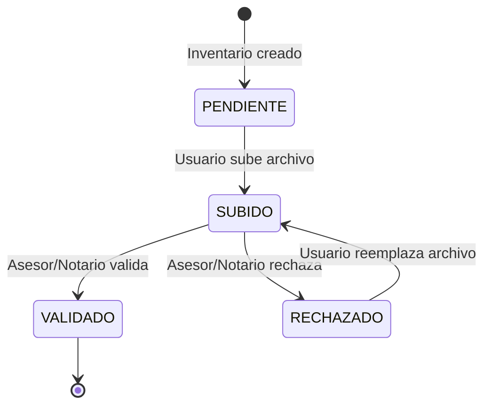

# Gestor Documental - Chrono-Flare

Sistema de gestión documental para expedientes de contratos de arras con trazabilidad criptográfica y sellado QTSP.

---

## Arquitectura

```
┌─────────────────────────────────────────────────────────────────┐
│                      FRONTEND                                    │
│  ┌─────────────────────────────────────────────────────────────┐│
│  │ GestorDocumental.tsx                                        ││
│  │  - Listado de documentos por grupo                          ││
│  │  - Filtros por estado y categoría                           ││
│  │  - Acciones: subir, validar, rechazar, descargar            ││
│  └─────────────────────────────────────────────────────────────┘│
│  ┌─────────────────────────────────────────────────────────────┐│
│  │ InventarioPanel.tsx + UploadModal.tsx                       ││
│  │  - Checklist de documentos requeridos                       ││
│  │  - Modal de subida con drag \u0026 drop                          ││
│  └─────────────────────────────────────────────────────────────┘│
└─────────────────────────────────────────────────────────────────┘
                              │
                              ▼
┌─────────────────────────────────────────────────────────────────┐
│                       BACKEND                                    │
│  ┌─────────────────────────────────────────────────────────────┐│
│  │ documentService.ts                                          ││
│  │  - Cálculo hash SHA-256                                     ││
│  │  - Sellado QTSP (RFC 3161)                                  ││
│  │  - Versionado de documentos                                 ││
│  │  - Registro de eventos                                      ││
│  └─────────────────────────────────────────────────────────────┘│
│  ┌───────────────────┐  ┌───────────────────┐                  │
│  │ inventario.ts     │  │ documentManager.ts│                  │
│  │ Rutas inventario  │  │ Rutas archivos    │                  │
│  └───────────────────┘  └───────────────────┘                  │
└─────────────────────────────────────────────────────────────────┘
                              │
                              ▼
┌─────────────────────────────────────────────────────────────────┐
│                     SUPABASE                                     │
│  ┌────────────────┐  ┌────────────────┐  ┌───────────────────┐  │
│  │ archivos       │  │ inventario_    │  │ sellos_tiempo     │  │
│  │                │  │ expediente     │  │                   │  │
│  └────────────────┘  └────────────────┘  └───────────────────┘  │
│  ┌────────────────────────────────────┐                         │
│  │ STORAGE: bucket "documentos"       │                         │
│  └────────────────────────────────────┘                         │
└─────────────────────────────────────────────────────────────────┘
```

---

## Grupos Documentales

| Grupo | Emoji | Color | Documentos |
|-------|-------|-------|------------|
| **INMUEBLE** | 🏠 | `#4a90d9` | Nota simple, escritura anterior, IBI, CEE |
| **PARTES** | 👥 | `#9b59b6` | DNI/NIE, poderes, régimen matrimonial |
| **ARRAS** | 💰 | `#27ae60` | Contrato borrador, firmado, justificante pago |
| **NOTARIA** | ⚖️ | `#e67e22` | Convocatoria, minuta, doc. identidad |
| **CIERRE** | ✅ | `#2ecc71` | Escritura compraventa, certificado |
| **URBANISTICO** | 🏗️ | `#1abc9c` | Licencias, cédulas |
| **ADMINISTRATIVO** | 📋 | `#3498db` | Permisos, autorizaciones |
| **LEGAL** | ⚖️ | `#8e44ad` | Contratos adicionales |
| **TECNICO** | 🔧 | `#f39c12` | Informes, certificaciones |
| **FISCAL** | 💼 | `#16a085` | Modelo 600, plusvalía |
| **ADICIONAL** | 📎 | `#95a5a6` | Documentos ad-hoc |

---

## Estados de Documentos

| Estado | Icono | Color | Descripción |
|--------|-------|-------|-------------|
| `PENDIENTE` | ⏳ | `#f39c12` | Aún no subido |
| `SUBIDO` | 📤 | `#3498db` | Subido, pendiente validación |
| `VALIDADO` | ✅ | `#27ae60` | Validado por rol autorizado |
| `RECHAZADO` | ❌ | `#e74c3c` | Rechazado con motivo |

---

## Flujo de Trabajo



### Ciclo de Vida Detallado

1. **Creación de Inventario**
   - Al crear contrato, se generan automáticamente los ítems obligatorios
   - Cada ítem tiene: tipo, grupo, responsable, obligatoriedad

2. **Subida de Documento**
   - Usuario sube archivo via modal
   - Sistema calcula hash SHA-256
   - Solicita sello QTSP (timestamp cualificado)
   - Guarda archivo en Supabase Storage
   - Actualiza inventario a `SUBIDO`
   - Registra evento `DOCUMENTO_SUBIDO`

3. **Validación**
   - Rol autorizado (asesor, notario) revisa documento
   - Puede **validar** → `VALIDADO`
   - Puede **rechazar** con motivo → `RECHAZADO`
   - Se registra evento con sello QTSP

4. **Reemplazo (si rechazado)**
   - Usuario sube nueva versión
   - Se mantiene historial de versiones
   - Nueva versión vuelve a `SUBIDO`

---

## API Endpoints

### Documentos del Expediente

```http
GET /api/contratos/:contratoId/documentos
```

**Respuesta:**
```json
{
  "success": true,
  "data": [
    {
      "inventarioId": "uuid",
      "tipo": "NOTA_SIMPLE",
      "titulo": "Nota Simple Registral",
      "descripcion": "Nota simple actualizada...",
      "grupo": "INMUEBLE",
      "responsableRol": "VENDEDOR",
      "estado": "VALIDADO",
      "obligatorio": true,
      "esCritico": true,
      "archivo": {
        "id": "uuid",
        "nombreOriginal": "nota_simple.pdf",
        "tipoMime": "application/pdf",
        "tamanoBytes": 245000,
        "hashSha256": "a1b2c3...",
        "version": 1,
        "fechaSubida": "2025-01-15T10:30:00Z"
      },
      "subidoPor": { "rol": "VENDEDOR", "fecha": "..." },
      "validadoPor": { "rol": "ASESOR_COMPRADOR", "fecha": "..." }
    }
  ],
  "resumen": {
    "total": 25,
    "pendientes": 5,
    "subidos": 3,
    "validados": 15,
    "rechazados": 2
  }
}
```

### Subir Documento

```http
POST /api/upload
Content-Type: multipart/form-data

file: [archivo]
contratoId: uuid
inventarioItemId: uuid
tipoDocumento: NOTA_SIMPLE
rol: VENDEDOR
```

**Respuesta:**
```json
{
  "success": true,
  "archivo": {
    "id": "uuid",
    "hashSha256": "a1b2c3...",
    "version": 1,
    "selloQtspId": "uuid"
  }
}
```

### Validar Documento

```http
POST /api/inventario/:inventarioId/validar
Content-Type: application/json

{
  "validadorRol": "ASESOR_COMPRADOR"
}
```

### Rechazar Documento

```http
POST /api/inventario/:inventarioId/rechazar
Content-Type: application/json

{
  "motivo": "El documento está ilegible",
  "validadorRol": "ASESOR_COMPRADOR"
}
```

### Descargar Archivo

```http
GET /api/archivos/:archivoId/descargar
```

### Vista Previa

```http
GET /api/archivos/:archivoId/preview
```

### Crear Requisito Ad-hoc

```http
POST /api/contratos/:contratoId/inventario/adhoc
Content-Type: application/json

{
  "tipo": "URBANISTICO",
  "titulo": "Certificado de compatibilidad urbanística",
  "descripcion": "Requerido por el notario",
  "grupo": "URBANISTICO",
  "responsableRol": "VENDEDOR",
  "esCritico": false,
  "creadoPorRol": "NOTARIO"
}
```

### Eliminar Documento

```http
DELETE /api/upload/:archivoId?rol=VENDEDOR
```

---

## Tablas de Base de Datos

### `inventario_expediente`

| Campo | Tipo | Descripción |
|-------|------|-------------|
| `id` | UUID | PK |
| `contrato_id` | UUID | FK a contratos_arras |
| `tipo` | VARCHAR | Tipo de documento |
| `titulo` | VARCHAR | Título mostrado |
| `descripcion` | TEXT | Instrucciones |
| `grupo` | VARCHAR | Grupo (INMUEBLE, PARTES...) |
| `subtipo` | VARCHAR | Subcategoría opcional |
| `responsable_rol` | VARCHAR | Rol que debe subir |
| `obligatorio` | BOOLEAN | ¿Requerido? |
| `es_critico` | BOOLEAN | ¿Bloquea transición? |
| `estado` | VARCHAR | PENDIENTE/SUBIDO/VALIDADO/RECHAZADO |
| `archivo_id` | UUID | FK a archivos |
| `subido_por_rol` | VARCHAR | Quien subió |
| `validado_por_rol` | VARCHAR | Quien validó/rechazó |
| `fecha_validacion` | TIMESTAMPTZ | Fecha validación |
| `motivo_rechazo` | TEXT | Si rechazado |

### `archivos`

| Campo | Tipo | Descripción |
|-------|------|-------------|
| `id` | UUID | PK |
| `contrato_id` | UUID | FK |
| `nombre_original` | TEXT | Nombre subido |
| `nombre_almacenado` | TEXT | Nombre en storage |
| `tipo_mime` | VARCHAR | MIME type |
| `tamano_bytes` | INTEGER | Tamaño |
| `ruta_local` | TEXT | Path en storage |
| `tipo_documento` | VARCHAR | Categoría legal |
| `hash_sha256` | VARCHAR(64) | Hash del archivo |
| `version` | INTEGER | Número de versión |
| `version_original_id` | UUID | ID primera versión |
| `es_vigente` | BOOLEAN | ¿Versión actual? |
| `reemplazado_por` | UUID | Nueva versión |
| `sello_qtsp_id` | UUID | FK a sellos_tiempo |

---

## Funciones del Servicio

### `registerDocument(params)`

Registra un nuevo documento:
1. Calcula hash SHA-256 del archivo
2. Solicita sello QTSP (timestamp cualificado)
3. Guarda en DB con referencia al sello
4. Actualiza inventario si aplica
5. Registra evento `DOCUMENTO_SUBIDO`

### `replaceDocument(params)`

Reemplaza un documento existente:
1. Obtiene documento original
2. Calcula nuevo hash y solicita sello
3. Crea nueva versión con `version + 1`
4. Marca versión anterior como `es_vigente = false`
5. Actualiza inventario a `SUBIDO` (re-validación)
6. Registra evento

### `validateDocument(inventarioItemId, validadorRol)`

1. Actualiza estado a `VALIDADO`
2. Sella evento de validación con QTSP
3. Registra evento `DOCUMENTO_VALIDADO`

### `rejectDocument(inventarioItemId, motivo, validadorRol)`

1. Actualiza estado a `RECHAZADO` con motivo
2. Sella evento de rechazo con QTSP
3. Registra evento `DOCUMENTO_RECHAZADO`

### `getDocumentHistory(archivoId)`

Retorna historial de versiones del documento.

---

## Tipos de Documento

### Inmueble y Situación
- `NOTA_SIMPLE` - Nota simple registral
- `ESCRITURA_ANTERIOR` - Escritura de adquisición
- `RECIBO_IBI` - Último recibo IBI
- `CERTIFICADO_COMUNIDAD` - Certificado de la comunidad
- `CERTIFICADO_EFICIENCIA_ENERGETICA` - CEE

### Partes y Representación
- `DNI_NIE_COMPRADOR` / `DNI_NIE_VENDEDOR`
- `PODER_COMPRADOR` / `PODER_VENDEDOR`
- `DOCUMENTACION_REGIMEN_MATRIMONIAL`

### Contractuales y Arras
- `CONTRATO_ARRAS_BORRADOR`
- `CONTRATO_ARRAS_FIRMADO`
- `JUSTIFICANTE_PAGO_ARRAS`

### Notaría y Escritura
- `CONVOCATORIA_NOTARIA`
- `MINUTA_ESCRITURA`
- `ESCRITURA_COMPRAVENTA_FIRMADA`
- `DOC_CANCELACION_HIPOTECA`

### Incidencias y Cierre
- `ACTA_NO_COMPARECENCIA`
- `CERTIFICADO_EVENTOS`

---

## Seguridad y Trazabilidad

### Hash SHA-256
Cada documento tiene un hash SHA-256 calculado al subir:
```typescript
const hashSum = createHash('sha256');
hashSum.update(fileBuffer);
const hash = hashSum.digest('hex');
```

### Sellado QTSP (RFC 3161)
Los documentos y eventos críticos se sellan con timestamp cualificado:
- Proveedor: EADTrust / GoCertius
- Formato: RFC 3161 TST en base64
- Almacenado en tabla `sellos_tiempo`

### Cadena de Eventos
Cada acción genera un evento encadenado con hash del evento anterior:
```
DOCUMENTO_SUBIDO → DOCUMENTO_VALIDADO → ...
     hash₁     ←       hash₂
```

---

## Componente Frontend

### Props
```typescript
interface GestorDocumentalProps {
  contratoId: string;
  rolActual: string;  // COMPRADOR, VENDEDOR, ASESOR_COMPRADOR, etc.
}
```

### Uso
```tsx
<GestorDocumental 
  contratoId="uuid-del-contrato" 
  rolActual="ASESOR_COMPRADOR" 
/>
```

### Funcionalidades
- **Filtros**: por grupo y estado
- **Tabs**: navegación por grupos documentales
- **Resumen**: badges con conteo por estado
- **Acciones**:
  - 📤 Subir (si PENDIENTE o RECHAZADO)
  - 👁️ Vista previa
  - ⬇️ Descargar
  - 🗑️ Eliminar
  - ✅ Validar (si SUBIDO)
  - ❌ Rechazar (si SUBIDO)
  - ℹ️ Ver detalle

---

## Permisos por Rol

| Acción | Comprador | Vendedor | Asesor | Notario |
|--------|-----------|----------|--------|---------|
| Ver documentos | ✅ | ✅ | ✅ | ✅ |
| Subir sus docs | ✅ | ✅ | ✅ | ✅ |
| Validar docs | ❌ | ❌ | ✅ | ✅ |
| Rechazar docs | ❌ | ❌ | ✅ | ✅ |
| Crear ad-hoc | ❌ | ❌ | ✅ | ✅ |
| Eliminar docs | ⚠️ Solo propios | ⚠️ Solo propios | ✅ | ✅ |
