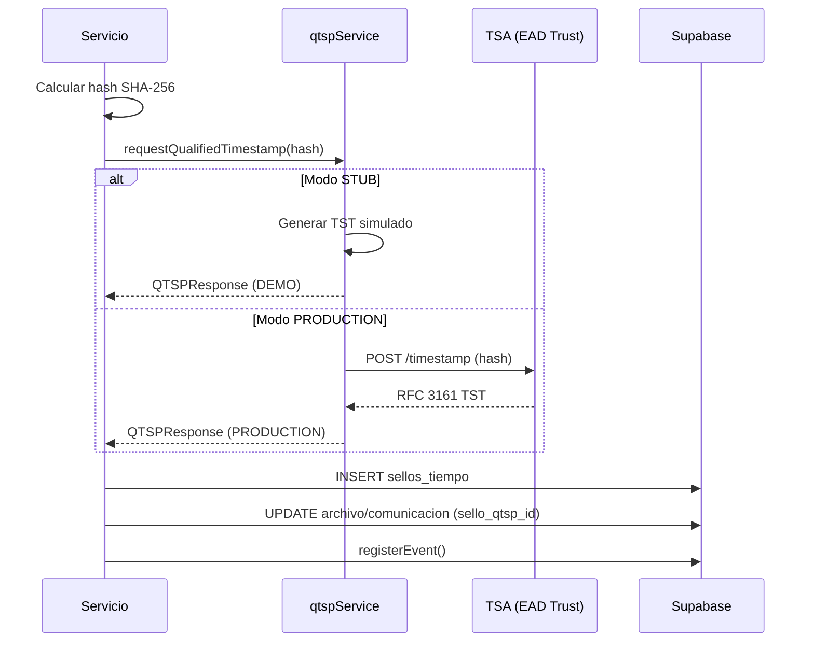

# Servicio QTSP - Chrono-Flare

Sistema de sellado de tiempo cualificado (QTSP - Qualified Trust Service Provider) para garantizar la integridad y no repudio de documentos y eventos en expedientes de contratos de arras.

---

## ¿Qué es QTSP?

Un **Proveedor de Servicios de Confianza Cualificado** (QTSP) es una entidad certificada bajo el Reglamento eIDAS de la UE que proporciona:

| Servicio | Descripción |
|----------|-------------|
| **TST (Time Stamp Token)** | Sello de tiempo cualificado RFC 3161 |
| **Firma Electrónica Cualificada** | Firma con validez legal plena |
| **Verificación** | Validación de sellos y firmas |

### Proveedores Soportados

| Proveedor | Marca | Estado |
|-----------|-------|--------|
| **EAD Trust** | GoCertius | ⚠️ Stub implementado |
| **EAD Trust** | GoCertius | 🔜 Integración real pendiente |

---

## Arquitectura

```
┌─────────────────────────────────────────────────────────────────┐
│                       SERVICIOS                                  │
│  ┌─────────────────┐  ┌─────────────────┐  ┌─────────────────┐  │
│  │ documentService │  │ communication-  │  │ certificateSer- │  │
│  │ .ts             │  │ Service.ts      │  │ vice.ts         │  │
│  └────────┬────────┘  └────────┬────────┘  └────────┬────────┘  │
│           │                    │                    │           │
│           └────────────────────┼────────────────────┘           │
│                                ▼                                 │
│  ┌─────────────────────────────────────────────────────────────┐│
│  │ qtspService.ts / eadTrustClient.ts                          ││
│  │  - obtenerSelloTiempo(hash)                                 ││
│  │  - firmarDocumento(buffer)                                  ││
│  │  - verificarSelloTiempo(token, hash)                        ││
│  └─────────────────────────────────────────────────────────────┘│
│           │                                                      │
│           ▼                                                      │
│  ┌─────────────────────────────────────────────────────────────┐│
│  │ MODO STUB (Desarrollo)             MODO PRODUCCIÓN          ││
│  │  - Token simulado SHA-256          - RFC 3161 TSA Real      ││
│  │  - Sin latencia real               - Certificado X.509      ││
│  │  - Sin verificación cripto         - Validación OCSP/CRL    ││
│  └─────────────────────────────────────────────────────────────┘│
└─────────────────────────────────────────────────────────────────┘
                              │
                              ▼
┌─────────────────────────────────────────────────────────────────┐
│                     SUPABASE                                     │
│  ┌────────────────┐  ┌────────────────┐  ┌───────────────────┐  │
│  │ sellos_tiempo  │  │ evidencias_    │  │ eventos           │  │
│  │                │  │ qtsp           │  │                   │  │
│  └────────────────┘  └────────────────┘  └───────────────────┘  │
└─────────────────────────────────────────────────────────────────┘
```

---

## Flujo de Sellado



---

## Componentes

### 1. Cliente EAD Trust (`eadTrustClient.ts`)

Cliente ligero para solicitar sellos de tiempo RFC 3161.

```typescript
import { requestQualifiedTimestamp } from '../qtsp/eadTrustClient.js';

const response = await requestQualifiedTimestamp(hashSha256);
// response: QTSPResponse
```

#### Interface QTSPResponse

```typescript
interface QTSPResponse {
  proveedor: 'EAD_TRUST';
  marca: 'GoCertius';
  fechaSello: string;           // ISO timestamp
  rfc3161TstBase64: string;     // Token TST en base64
  metadata: {
    mode: 'DEMO' | 'PRODUCTION';
    [key: string]: any;
  };
}
```

---

### 2. Servicio QTSP (`qtspService.ts`)

Servicio completo con soporte para múltiples proveedores.

```typescript
import { qtspService, calcularHash } from '../services/qtspService.js';

// Calcular hash
const hash = calcularHash(contenido);

// Obtener sello de tiempo
const tst = await qtspService.obtenerSelloTiempo(hash);

// Firmar documento
const firma = await qtspService.firmarDocumento(pdfBuffer);

// Verificar sello
const esValido = await qtspService.verificarSelloTiempo(token, hash);
```

#### Tipos Principales

```typescript
enum QTSPProvider {
  GOCERTIUS = 'GOCERTIUS',
  EAD_TRUST = 'EAD_TRUST',
}

interface TimeStampToken {
  token: string;           // Token TST
  fecha: Date;             // Timestamp UTC
  proveedor: QTSPProvider;
  hash_original: string;   // Hash sellado
  algoritmo: string;       // 'SHA-256'
}

interface SignedDocument {
  signature: string;       // Firma cualificada
  certificate: string;     // Certificado X.509
  fecha: Date;
  proveedor: QTSPProvider;
  hash_documento: string;
}
```

---

## Funciones Disponibles

### `requestQualifiedTimestamp(hash)`

Solicita un sello de tiempo cualificado sobre un hash SHA-256.

| Parámetro | Tipo | Descripción |
|-----------|------|-------------|
| `hash` | `string` | Hash SHA-256 (64 chars hex) |
| **Retorno** | `QTSPResponse` | Token TST con metadata |

### `obtenerSelloTiempo(hash)`

Método del servicio para obtener TST.

### `firmarDocumento(buffer)`

Firma un documento PDF con firma cualificada.

| Parámetro | Tipo | Descripción |
|-----------|------|-------------|
| `buffer` | `Buffer` | Contenido del PDF |
| **Retorno** | `SignedDocument` | Firma con certificado |

### `verificarSelloTiempo(token, hash)`

Verifica la validez de un sello de tiempo.

| Parámetro | Tipo | Descripción |
|-----------|------|-------------|
| `token` | `string` | Token TST |
| `hash` | `string` | Hash original |
| **Retorno** | `boolean` | `true` si válido |

---

## Funciones Helper

### `calcularHash(contenido)`

Calcula hash SHA-256.

```typescript
const hash = calcularHash('contenido a sellar');
// → '2cf24dba5fb0a30e26e83b2...'
```

### `serializarCanónico(obj)`

Serializa un objeto ordenando keys alfabéticamente para hash consistente.

```typescript
const canonical = serializarCanónico({ z: 1, a: 2 });
// → '{"a":2,"z":1}'
```

### `crearHashEvento(payload, prevHash)`

Crea hash encadenado con evento anterior (blockchain-like).

```typescript
const hash = crearHashEvento(
  { tipo: 'DOCUMENTO_SUBIDO', archivo_id: 'uuid' },
  'hash_evento_anterior'
);
```

---

## Tablas de Base de Datos

### `sellos_tiempo`

Almacena los sellos de tiempo emitidos.

| Campo | Tipo | Descripción |
|-------|------|-------------|
| `id` | UUID | PK |
| `proveedor` | VARCHAR | EAD_TRUST |
| `marca` | VARCHAR | GoCertius |
| `hash_sha256` | VARCHAR(64) | Hash sellado |
| `rfc3161_tst_base64` | TEXT | Token TST |
| `fecha_sello` | TIMESTAMPTZ | Fecha del sello |
| `estado` | VARCHAR | EMITIDO, VERIFICADO, ERROR |
| `metadata_json` | JSONB | Datos adicionales |

### `evidencias_qtsp`

Vincula sellos a eventos del expediente.

| Campo | Tipo | Descripción |
|-------|------|-------------|
| `id` | UUID | PK |
| `evento_id` | UUID | FK a eventos |
| `algoritmo_hash` | VARCHAR | 'SHA-256' |
| `hash_calculado` | TEXT | Hash del evento |
| `tst_raw` | BYTEA | Token TST binario |
| `tst_base64` | TEXT | Token TST base64 |
| `tst_serial_number` | TEXT | Número de serie |
| `authority_key_id` | TEXT | ID de autoridad |
| `authority_name` | TEXT | Nombre TSA |
| `policy_oid` | TEXT | OID de política |
| `fecha_sello` | TIMESTAMPTZ | Fecha del sello |
| `estado` | VARCHAR | PENDIENTE, SELLADO, ERROR, VERIFICADO |

---

## Modos de Operación

### Modo STUB (Desarrollo)

```bash
# .env
QTSP_MODE=stub
QTSP_STUB_MODE=true
```

| Característica | Comportamiento |
|----------------|----------------|
| Token | SHA-256 hash simulado |
| Latencia | Sin latencia de red |
| Verificación | Validación de formato |
| Certificado | `CERT-GOCERTIUS-{timestamp}` |

### Modo PRODUCTION (Producción)

```bash
# .env
QTSP_MODE=production
QTSP_STUB_MODE=false
QTSP_PROVIDER=GOCERTIUS

# Credenciales reales
GOCERTIUS_API_URL=https://api.gocertius.com
GOCERTIUS_API_KEY=your_api_key
EAD_TRUST_API_URL=https://api.eadtrust.eu
EAD_TRUST_API_KEY=your_api_key
```

---

## Integración con Servicios

### documentService.ts

```typescript
// Al subir documento
const hashSha256 = calculateFileHash(filePath);
const qtspResponse = await requestQualifiedTimestamp(hashSha256);

// Guardar sello
const { data: sello } = await supabase
  .from('sellos_tiempo')
  .insert({
    proveedor: qtspResponse.proveedor,
    marca: qtspResponse.marca,
    hash_sha256: hashSha256,
    rfc3161_tst_base64: qtspResponse.rfc3161TstBase64,
    fecha_sello: qtspResponse.fechaSello,
    estado: 'EMITIDO'
  });

// Vincular al archivo
await supabase
  .from('archivos')
  .update({ sello_qtsp_id: sello.id })
  .eq('id', archivoId);
```

### communicationService.ts

```typescript
// Al enviar comunicación
const hashContenido = calculateContentHash(contenido);
const selloQtspId = await sealCommunication(comunicacionId, hashContenido, contratoId);
```

### eventService.ts

```typescript
// Al registrar evento crítico
const hashEvento = crearHashEvento(payload, prevHash);
const tst = await qtspService.obtenerSelloTiempo(hashEvento);

// Guardar evidencia
await supabase
  .from('evidencias_qtsp')
  .insert({
    evento_id: eventoId,
    hash_calculado: hashEvento,
    tst_base64: tst.token,
    fecha_sello: tst.fecha,
    estado: 'SELLADO'
  });
```

---

## Encadenamiento de Eventos

Los eventos se encadenan criptográficamente (blockchain-like):

```
┌─────────────────┐     ┌─────────────────┐     ┌─────────────────┐
│ Evento 1        │     │ Evento 2        │     │ Evento 3        │
│                 │     │                 │     │                 │
│ hash_sha256: H1 │←────│ prev_hash: H1   │←────│ prev_hash: H2   │
│ prev_hash: null │     │ hash_sha256: H2 │     │ hash_sha256: H3 │
└─────────────────┘     └─────────────────┘     └─────────────────┘
```

Esto garantiza:
- **Inmutabilidad**: Modificar un evento rompe la cadena
- **Ordenamiento**: Secuencia verificable
- **Auditoría**: Trail completo de cambios

---

## Eventos que Generan Sello QTSP

| Servicio | Evento | Automático |
|----------|--------|------------|
| Documentos | `DOCUMENTO_SUBIDO` | ✅ |
| Documentos | `DOCUMENTO_VALIDADO` | ✅ |
| Documentos | `DOCUMENTO_RECHAZADO` | ✅ |
| Comunicaciones | `COMUNICACION_ENVIADA` | ✅ |
| Comunicaciones | `COMUNICACION_EXTERNA_IMPORTADA` | ✅ |
| Firmas | `FIRMA_ELECTRONICA_EMITIDA` | ✅ |
| Contrato | `ESTADO_CAMBIADO` | ✅ |
| Certificados | `CERTIFICADO_GENERADO` | ✅ |

---

## Verificación de Integridad

### Verificar Sello de Tiempo

```typescript
const esValido = await qtspService.verificarSelloTiempo(token, hashOriginal);
```

### Verificar Cadena de Eventos

```typescript
async function verificarCadena(contratoId: string): Promise<boolean> {
  const { data: eventos } = await supabase
    .from('eventos')
    .select('*')
    .eq('contrato_id', contratoId)
    .order('fecha_hora', { ascending: true });

  let prevHash = null;
  for (const evento of eventos) {
    const hashCalculado = crearHashEvento(evento.payload, prevHash);
    if (hashCalculado !== evento.hash_sha256) {
      console.error(`❌ Evento ${evento.id} tiene hash inconsistente`);
      return false;
    }
    prevHash = evento.hash_sha256;
  }
  return true;
}
```

---

## Roadmap de Producción

### Fase 1: Integración Real (Pendiente)

1. **Credenciales**: Obtener API keys de GoCertius/EAD Trust
2. **Implementar**: Métodos `*Real()` en `qtspService.ts`
3. **Certificados**: Configurar certificados X.509 de la TSA
4. **Verificación**: Implementar validación OCSP/CRL

### Fase 2: Digital Trust API

Migrar a Digital Trust API de GCloud Factory:
- Case File por contrato
- Evidence Group por tipo de evento
- Evidence por evento individual

Ver: [DIGITAL_TRUST_INTEGRATION.md](./DIGITAL_TRUST_INTEGRATION.md)

---

## Variables de Entorno

```bash
# Modo de operación
QTSP_MODE=stub                    # 'stub' | 'production'
QTSP_STUB_MODE=true               # 'true' | 'false'
QTSP_PROVIDER=GOCERTIUS           # 'GOCERTIUS' | 'EAD_TRUST'

# GoCertius (Producción)
GOCERTIUS_API_URL=https://api.gocertius.com
GOCERTIUS_API_KEY=your_api_key

# EAD Trust (Producción)
EAD_TRUST_API_URL=https://api.eadtrust.eu
EAD_TRUST_API_KEY=your_api_key
EAD_TRUST_TSA_URL=https://tsa.eadtrust.eu
```

---

## Cumplimiento Normativo

| Norma | Cumplimiento |
|-------|--------------|
| **eIDAS** | ✅ Sellado de tiempo cualificado |
| **RFC 3161** | ✅ Formato TST estándar |
| **ETSI TS 101 861** | ✅ Políticas de sellado |
| **Lista TSL (EU)** | ✅ Proveedor en lista de confianza |

---

## Troubleshooting

### Error: "Modo QTSP de producción no implementado aún"

Causa: `QTSP_MODE=production` pero no hay implementación real.

Solución: Cambiar a `QTSP_MODE=stub` o implementar integración real.

### Token TST vacío o inválido

Causa: El servicio QTSP no está respondiendo.

Solución: Verificar credenciales y conectividad con la TSA.

### Hash inconsistente en cadena de eventos

Causa: Un evento fue modificado después de registrarse.

Solución: Investigar integridad de la base de datos.
